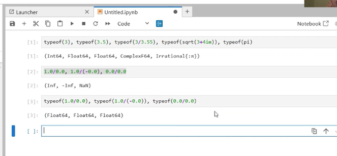

---
## Front matter
lang: ru-RU
title: Компьютерный практикум по статистическому анализу данных. Лаб №1
subtitle: "Julia. Установка и настройка. Основные принципы."
author:
  - Шаповалова Диана Дмитриевна
institute:
  - Российский университет дружбы народов, Москва, Россия
date: 14 ноября 2024

## i18n babel
babel-lang: russian
babel-otherlangs: english

## Formatting pdf
toc: false
toc-title: Содержание
slide_level: 2
aspectratio: 169
section-titles: true
theme: metropolis
header-includes:
 - \metroset{progressbar=frametitle,sectionpage=progressbar,numbering=fraction}
---

# Вводная часть

## Цель работы

Основная цель работы — подготовить рабочее пространство и инструментарий для
работы с языком программирования Julia, на простейших примерах познакомиться
с основами синтаксиса Julia.

# Выполнение лабораторной работы

## Подготовка инструментария к работе

Установите Julia (https://julialang.org/) и Jupyter (https://jupyter.org/) под
вашу операционную систему. 

{#fig:001 width=100% height=100%}

{#fig:002 width=100% height=100%}

{#fig:003 width=100% height=100%}

{#fig:004 width=100% height=100%}

{#fig:005 width=100% height=100%}

## Основы работы в блокноте Jupyter

Запустите Jupyter Lab.

{#fig:006 width=100% height=100%}

## Основы синтаксиса Julia на примерах

{#fig:007 width=100% height=100%}

## Задания для самостоятельной работы

{#fig:008 width=100% height=100%}

{#fig:009 width=100% height=100%}

{#fig:010 width=100% height=100%}

{#fig:011 width=100% height=100%}

{#fig:012 width=100% height=100%}

{#fig:012 width=100% height=100%}

# Выводы 

Мы подготовили наше рабочее пространство и интрументарий для работы с языком программирования Julia, а также познакомились
с основами синтаксиса Julia

# Список литературы

[1] Julia Documentation: https://docs.julialang.org/en/v1/

