---
## Front matter
title: "Отчёт по лабораторной работе №1 по дисциплине
Компьютерный практикум по статистическому анализу данных"
subtitle: "Julia. Установка и настройка. Основные принципы."
author: "Шаповалова Диана Дмитриевна"

## Generic otions
lang: ru-RU
toc-title: "Содержание"

## Bibliography
bibliography: bib/cite.bib
csl: pandoc/csl/gost-r-7-0-5-2008-numeric.csl

## Pdf output format
toc: true # Table of contents
toc-depth: 2
lof: true # List of figures
lot: true # List of tables
fontsize: 12pt
linestretch: 1.5
papersize: a4
documentclass: scrreprt
## I18n polyglossia
polyglossia-lang:
  name: russian
  options:
	- spelling=modern
	- babelshorthands=true
polyglossia-otherlangs:
  name: english
## I18n babel
babel-lang: russian
babel-otherlangs: english
## Fonts
mainfont: IBM Plex Serif
romanfont: IBM Plex Serif
sansfont: IBM Plex Sans
monofont: IBM Plex Mono
mathfont: STIX Two Math
mainfontoptions: Ligatures=Common,Ligatures=TeX,Scale=0.94
romanfontoptions: Ligatures=Common,Ligatures=TeX,Scale=0.94
sansfontoptions: Ligatures=Common,Ligatures=TeX,Scale=MatchLowercase,Scale=0.94
monofontoptions: Scale=MatchLowercase,Scale=0.94,FakeStretch=0.9
mathfontoptions:
## Biblatex
biblatex: true
biblio-style: "gost-numeric"
biblatexoptions:
  - parentracker=true
  - backend=biber
  - hyperref=auto
  - language=auto
  - autolang=other*
  - citestyle=gost-numeric
## Pandoc-crossref LaTeX customization
figureTitle: "Рис."
tableTitle: "Таблица"
listingTitle: "Листинг"
lofTitle: "Список иллюстраций"
lotTitle: "Список таблиц"
lolTitle: "Листинги"
## Misc options
indent: true
header-includes:
  - \usepackage{indentfirst}
  - \usepackage{float} # keep figures where there are in the text
  - \floatplacement{figure}{H} # keep figures where there are in the text
---

# Цель работы

Основная цель работы — подготовить рабочее пространство и инструментарий для
работы с языком программирования Julia, на простейших примерах познакомиться
с основами синтаксиса Julia.

# Выполнение лабораторной работы

## Подготовка инструментария к работе

Установите Julia (https://julialang.org/) и Jupyter (https://jupyter.org/) под
вашу операционную систему. 

Для ОС типа Windows рекомендуется для установки использовать менеджер пакетов
Chocolatey (https://chocolatey.org/), устанавливаемый через Administrative Shell. Далее
рекомендуется посредством данного менеджера установить Far Manager, Notepad++, Julia,
Anaconda Distribution (Python 3.x). (рис. [-@fig:001] - рис. [-@fig:004])

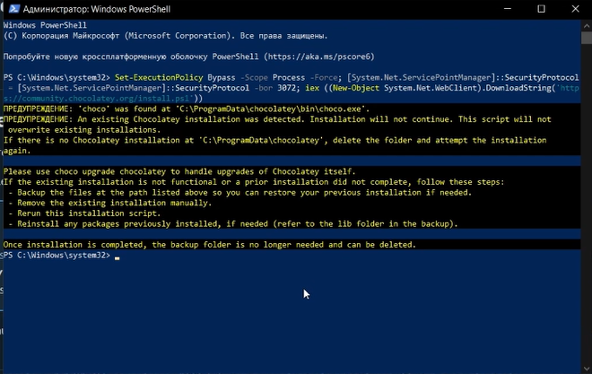{#fig:001 width=100% height=100%}

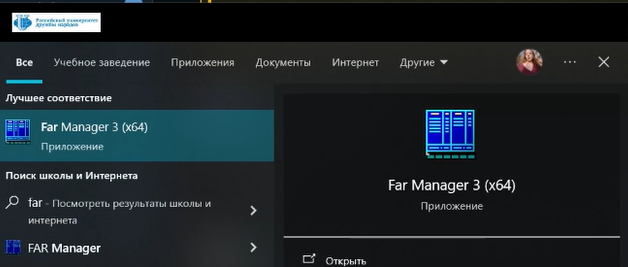{#fig:002 width=100% height=100%}

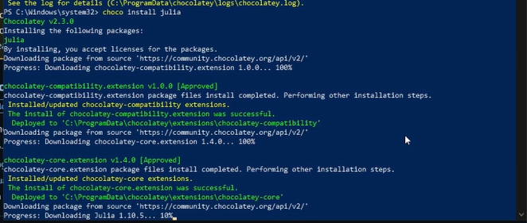{#fig:003 width=100% height=100%}

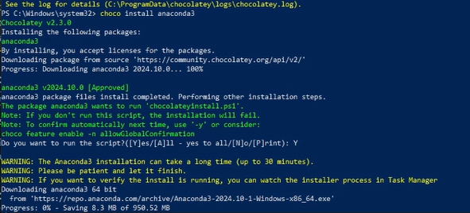{#fig:004 width=100% height=100%}

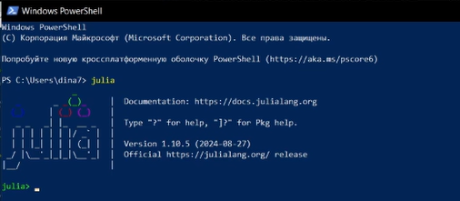{#fig:005 width=100% height=100%}

## Основы работы в блокноте Jupyter

Запустите Jupyter Lab. (рис. [-@fig:006])

– a или b — создать новую ячейку соответственно выше или ниже текущей;

– x — удалить ячейку;

– z — отмена удаления ячейки;

– m — перевести ячейку в режим текста;

– y — перевести ячейку в режим набора кода

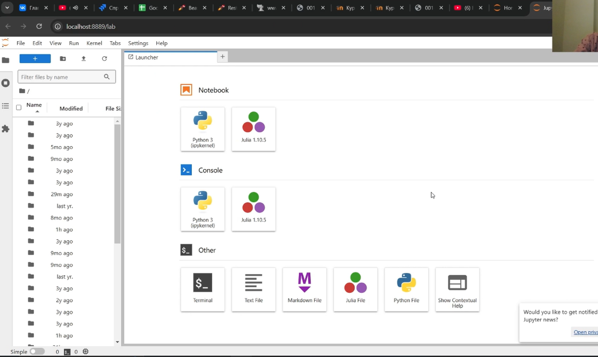{#fig:006 width=100% height=100%}

## Основы синтаксиса Julia на примерах

В Julia преобразование типов можно реализовать или прямым указанием, например
вещественное число 2.0 преобразовать в целое, а число 2 в символ:
Int64(2.0), Char(2)

или использовать обобщённый оператор преобразования типов convert(), например:
convert(Int64, 2.0), convert(Char,2)

Преобразование 1 в булевое true, 0 — в булевое false:
Bool(1), Bool(0)

Для приведения нескольких аргументов к одному типу, если это возможно, используется оператор promote(), например:
promote(Int8(1), Float16(4.5), Float32(4.1))

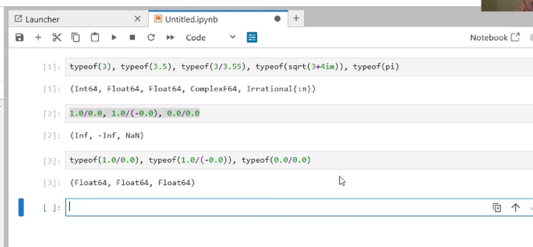{#fig:007 width=100% height=100%}

## Задания для самостоятельной работы

1. Изучите документацию по основным функциям Julia для чтения / записи / вывода информации на экран: read(), readline(), readlines(), readdlm(), print(),
println(), show(), write(). Приведите свои примеры их использования, поясняя особенности их применения. (рис. [-@fig:008] - рис. [-@fig:010])

Функция read() используется для чтения содержимого файла или потока. Она позволяет прочитать данные в бинарном или текстовом формате.

Функция readline() читает одну строку из файла или стандартного потока ввода.

Функция readlines() считывает все строки файла и возвращает их в виде массива строк.

Функция readdlm() (read delimited) используется для чтения данных из файла с разделителями (например, CSV) в виде таблицы.

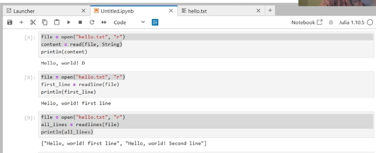{#fig:008 width=100% height=100%}

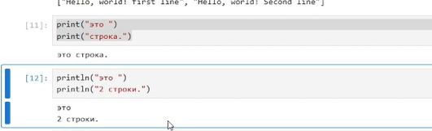{#fig:009 width=100% height=100%}

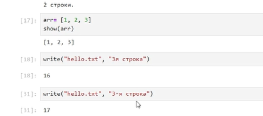{#fig:010 width=100% height=100%}

2. Изучите документацию по функции parse(). Приведите свои примеры её использования, поясняя особенности её применения. (рис. [-@fig:011])

Функция parse() в Julia используется для преобразования строки в значение заданного типа. Она особенно полезна, когда нужно перевести текстовое представление числа или другого типа данных в соответствующий числовой или логический формат.

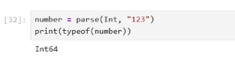{#fig:011 width=100% height=100%}

3. Изучите синтаксис Julia для базовых математических операций с разным типом переменных: сложение, вычитание, умножение, деление, возведение в степень, извлечение
корня, сравнение, логические операции. Приведите свои примеры с пояснениями по особенностям их применения. (рис. [-@fig:012])

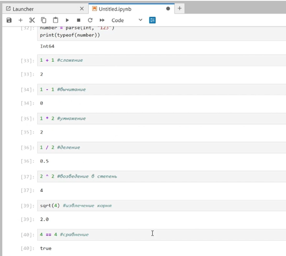{#fig:012 width=100% height=100%}

4. Приведите несколько своих примеров с пояснениями с операциями над матрицами и векторами: сложение, вычитание, скалярное произведение, транспонирование,
умножение на скаляр. (рис. [-@fig:013])

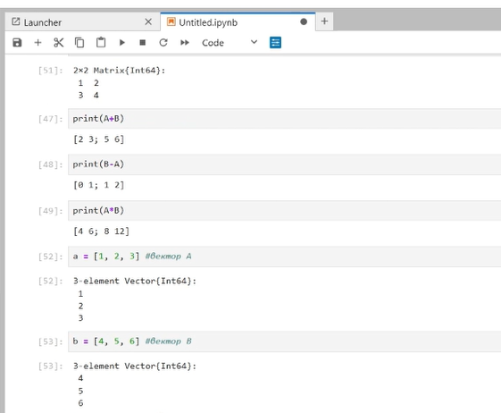{#fig:013 width=100% height=100%}

# Выводы

Мы подготовили наше рабочее пространство и интрументарий для работы с языком программирования Julia, а также познакомились
с основами синтаксиса Julia

# Список литературы

[1] Julia Documentation: https://docs.julialang.org/en/v1/
