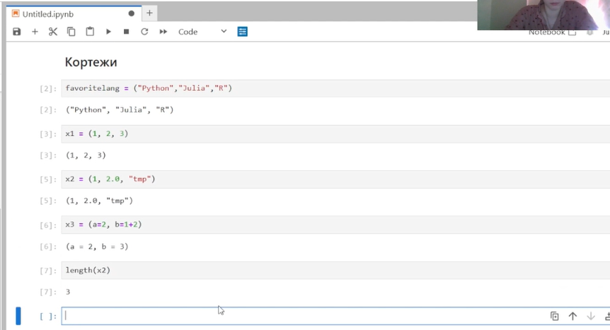
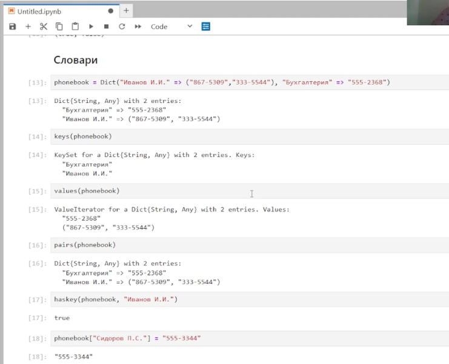
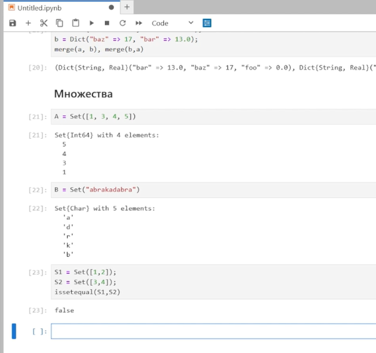
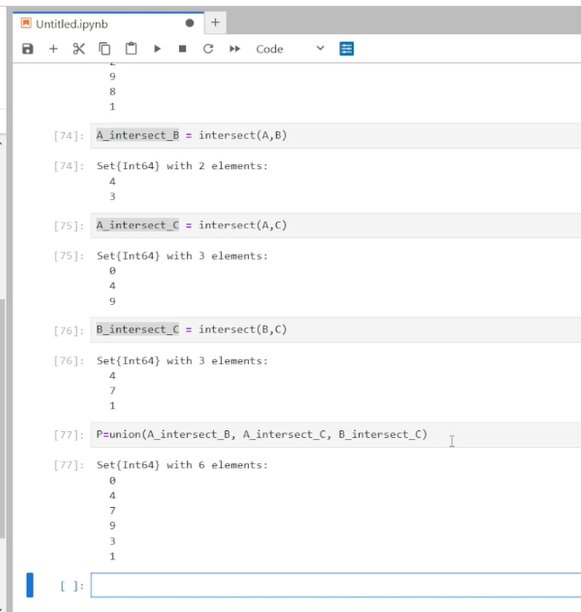
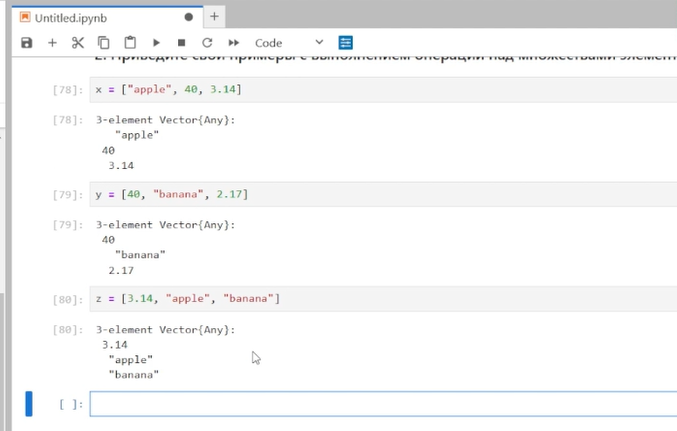
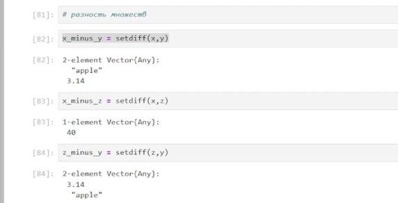
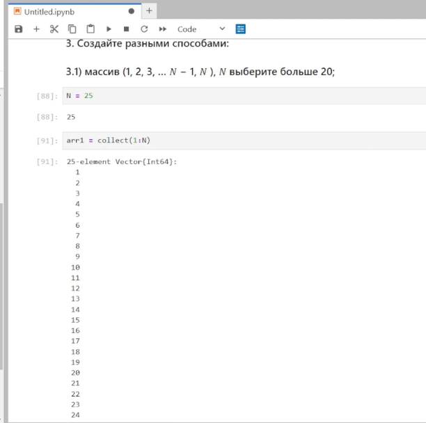
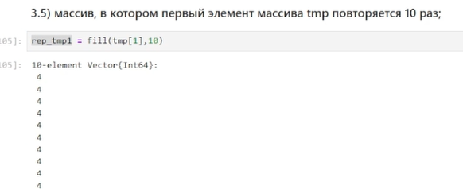
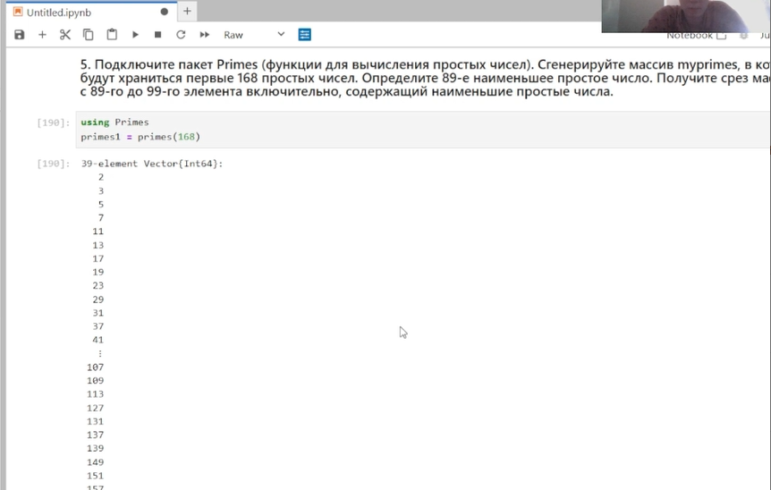
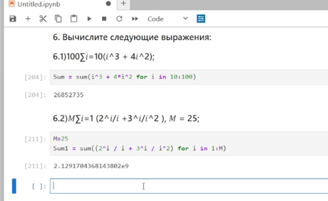

---
## Front matter
lang: ru-RU
title: "Компьютерный практикум по статистическому анализу данных. Лаб №2"
subtitle: "Структуры данных."
author:
  - Шаповалова Диана Дмитриевна
institute:
  - Российский университет дружбы народов, Москва, Россия
date: 19 ноября 2024

## i18n babel
babel-lang: russian
babel-otherlangs: english

## Formatting pdf
toc: false
toc-title: Содержание
slide_level: 2
aspectratio: 169
section-titles: true
theme: metropolis
header-includes:
 - \metroset{progressbar=frametitle,sectionpage=progressbar,numbering=fraction}
---

# Вводная часть

## Цель работы

Основная цель работы — изучить несколько структур данных, реализованных в Julia,
научиться применять их и операции над ними для решения задач.

# Выполнение лабораторной работы

## Кортежи

{#fig:001 width=100% height=100%}

## Словари

{#fig:002 width=100% height=100%}

## Множества

{#fig:003 width=100% height=100%}

# Задания для самостоятельного выполнения

## 1. Даны множества: 𝐴 = {0, 3, 4, 9}, 𝐵 = {1, 3, 4, 7}, 𝐶 = {0, 1, 2, 4, 7, 8, 9}. Найти 𝑃 = 𝐴 ∩ 𝐵 ∪ 𝐴 ∩ 𝐵 ∪ 𝐴 ∩ 𝐶 ∪ 𝐵 ∩ 𝐶.

{#fig:004 width=100% height=100%}

## 2. Приведите свои примеры с выполнением операций над множествами элементов разных типов

{#fig:005 width=100% height=100%}

## 2. Приведите свои примеры с выполнением операций над множествами элементов разных типов

{#fig:006 width=100% height=100%}

## 3. Создайте разными способами: 3.1) массив (1, 2, 3, … 𝑁 − 1, 𝑁 ), 𝑁 выберите больше 20;

{#fig:007 width=100% height=100%}

## 3.5) массив, в котором первый элемент массива tmp повторяется 10 раз;

{#fig:008 width=100% height=100%}

## 5. Подключите пакет Primes (функции для вычисления простых чисел). Сгенерируйте массив myprimes, в котором будут храниться первые 168 простых чисел. Определите 89-е наименьшее простое число. Получите срез массива с 89-го до 99-го элемента включительно, содержащий наименьшие простые числа.

{#fig:008 width=100% height=100%}

## 6. Вычислите следующие выражения

{#fig:009 width=100% height=100%}

# Выводы

Мы изучили несколько структур данных, реализованных в Julia, и научились применять их и операции над ними для решения задач

