---
## Front matter
title: "Отчёт по лабораторной работе №2 по дисциплине
Компьютерный практикум по статистическому анализу данных"
subtitle: "Структуры данных"
author: "Шаповалова Диана Дмитриевна"

## Generic otions
lang: ru-RU
toc-title: "Содержание"

## Bibliography
bibliography: bib/cite.bib
csl: pandoc/csl/gost-r-7-0-5-2008-numeric.csl

## Pdf output format
toc: true # Table of contents
toc-depth: 2
lof: true # List of figures
lot: true # List of tables
fontsize: 12pt
linestretch: 1.5
papersize: a4
documentclass: scrreprt
## I18n polyglossia
polyglossia-lang:
  name: russian
  options:
	- spelling=modern
	- babelshorthands=true
polyglossia-otherlangs:
  name: english
## I18n babel
babel-lang: russian
babel-otherlangs: english
## Fonts
mainfont: IBM Plex Serif
romanfont: IBM Plex Serif
sansfont: IBM Plex Sans
monofont: IBM Plex Mono
mathfont: STIX Two Math
mainfontoptions: Ligatures=Common,Ligatures=TeX,Scale=0.94
romanfontoptions: Ligatures=Common,Ligatures=TeX,Scale=0.94
sansfontoptions: Ligatures=Common,Ligatures=TeX,Scale=MatchLowercase,Scale=0.94
monofontoptions: Scale=MatchLowercase,Scale=0.94,FakeStretch=0.9
mathfontoptions:
## Biblatex
biblatex: true
biblio-style: "gost-numeric"
biblatexoptions:
  - parentracker=true
  - backend=biber
  - hyperref=auto
  - language=auto
  - autolang=other*
  - citestyle=gost-numeric
## Pandoc-crossref LaTeX customization
figureTitle: "Рис."
tableTitle: "Таблица"
listingTitle: "Листинг"
lofTitle: "Список иллюстраций"
lotTitle: "Список таблиц"
lolTitle: "Листинги"
## Misc options
indent: true
header-includes:
  - \usepackage{indentfirst}
  - \usepackage{float} # keep figures where there are in the text
  - \floatplacement{figure}{H} # keep figures where there are in the text
---

# Цель работы

Основная цель работы — изучить несколько структур данных, реализованных в Julia,
научиться применять их и операции над ними для решения задач.

# Выполнение лабораторной работы

## Кортежи
Примеры кортежей:

#пустой кортеж:

()

#кортеж из элементов типа String:

favoritelang = ("Python","Julia","R")

#кортеж из целых чисел:

x1 = (1, 2, 3)

#кортеж из элементов разных типов:

x2 = (1, 2.0, "tmp")

#именованный кортеж:

x3 = (a=2, b=1+2)

Примеры операций над кортежами:

#длина кортежа x2:

length(x2)

и т.д.

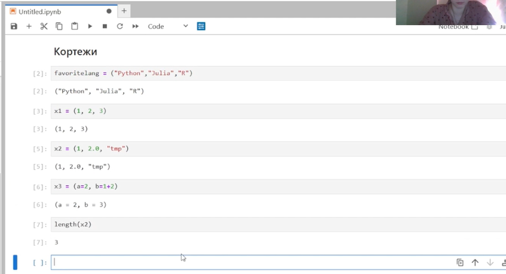{#fig:001 width=100% height=100%}

## Словари

Словарь — неупорядоченный набор связанных между собой по ключу данных.

Синтаксис определения словаря:

Dict(key1 => value1, key2 => value2, ...)

Примеры словарей и операций над ними:

#создать словарь с именем phonebook:

phonebook = Dict("Иванов И.И." => ("867-5309","333-5544"), "Бухгалтерия" => "555-2368")

#вывести ключи словаря:

keys(phonebook)

#вывести значения элементов словаря:

values(phonebook)

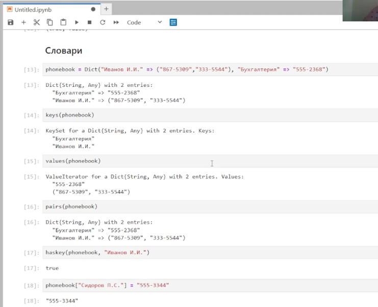{#fig:002 width=100% height=100%}

## Множества

Множество, как структура данных в Julia, соответствует множеству, как математическому объекту, то есть является неупорядоченной совокупностью элементов какого-либо
типа. Возможные операции над множествами: объединение, пересечение, разность; принадлежность элемента множеству.

Примеры множеств и операций над ними:

#создать множество из четырёх целочисленных значений:

A = Set([1, 3, 4, 5])

#создать множество из 11 символьных значений:

B = Set("abrakadabra")

#проверка эквивалентности двух множеств:

S1 = Set([1,2]);

S2 = Set([3,4]);

issetequal(S1,S2)

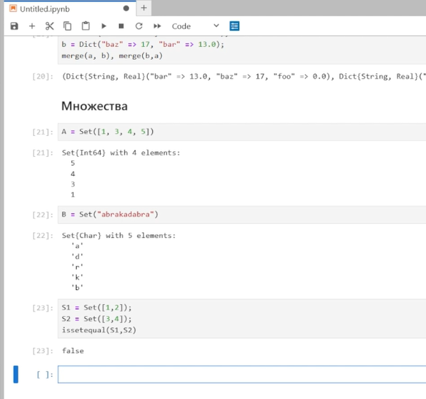{#fig:003 width=100% height=100%}

## Массивы

Массив — коллекция упорядоченных элементов, размещённая в многомерной сетке.
Векторы и матрицы являются частными случаями массивов.

Общий синтаксис одномерных массивов:

array_name_1 = [element1, element2, ...]

array_name_2 = [element1 element2 ...]

Примеры массивов:

#создание пустого массива с абстрактным типом:

empty_array_1 = []

#создание пустого массива с конкретным типом:

empty_array_2 = (Int64)[]

empty_array_3 = (Float64)[]

##  Задания для самостоятельного выполнения

## 1. Даны множества: 𝐴 = {0, 3, 4, 9}, 𝐵 = {1, 3, 4, 7}, 𝐶 = {0, 1, 2, 4, 7, 8, 9}. Найти 𝑃 = 𝐴 ∩ 𝐵 ∪ 𝐴 ∩ 𝐵 ∪ 𝐴 ∩ 𝐶 ∪ 𝐵 ∩ 𝐶.

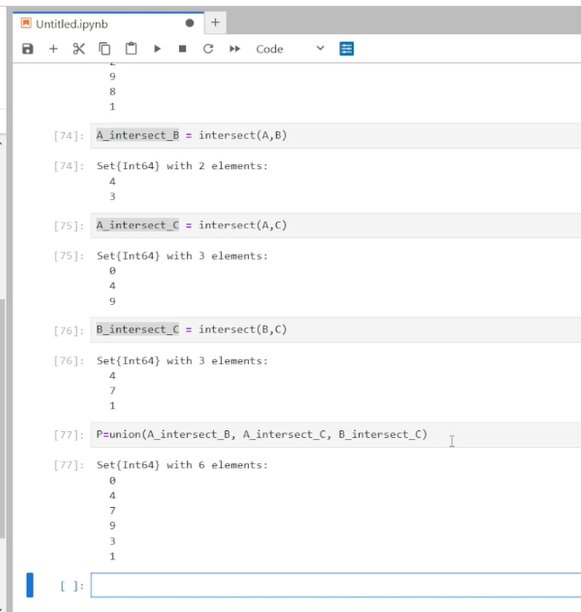{#fig:004 width=100% height=100%}

## 2. Приведите свои примеры с выполнением операций над множествами элементов разных типов

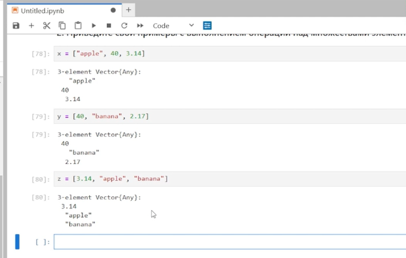{#fig:005 width=100% height=100%}

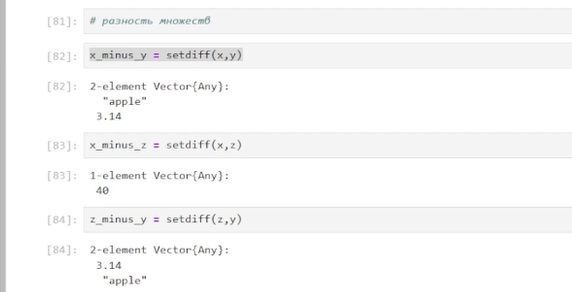{#fig:006 width=100% height=100%}

## 3. Создайте разными способами:
## 3.1) массив (1, 2, 3, … 𝑁 − 1, 𝑁 ), 𝑁 выберите больше 20;

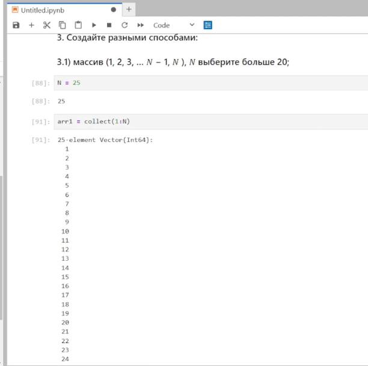{#fig:007 width=100% height=100%}

## 3.2) массив (𝑁, 𝑁 − 1 … , 2, 1), 𝑁 выберите больше 20;

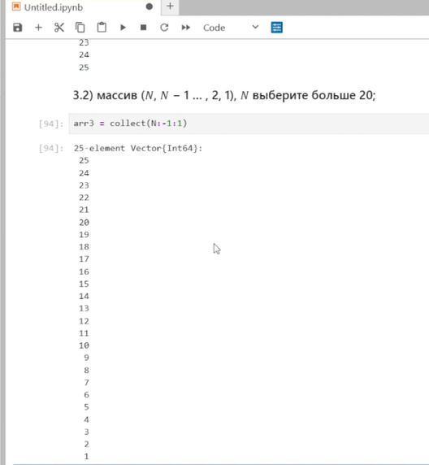{#fig:008 width=100% height=100%}

## 3.3) массив (1, 2, 3, … , 𝑁 − 1, 𝑁, 𝑁 − 1, … , 2, 1), 𝑁 выберите больше 20;

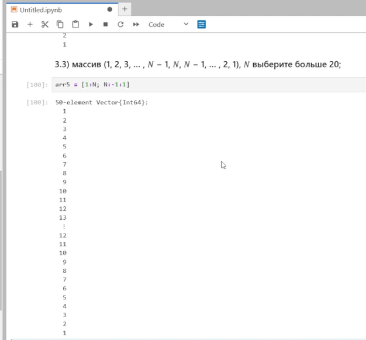{#fig:009 width=100% height=100%}

## 3.4) массив с именем tmp вида (4, 6, 3);

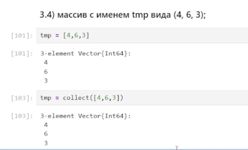{#fig:010 width=100% height=100%}

## 3.5) массив, в котором первый элемент массива tmp повторяется 10 раз;

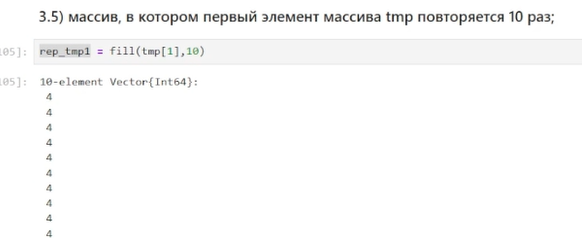{#fig:011 width=100% height=100%}

(Заданий слишком много в пункте 3, поэтому все остальные задания [находятся тут](https://github.com/ddshapovalova/study_2024-2025_computer-practice/blob/master/labs/lab2/lab2.ipynb) )

## 5. Подключите пакет Primes (функции для вычисления простых чисел). Сгенерируйте массив myprimes, в котором будут храниться первые 168 простых чисел. Определите 89-е наименьшее простое число. Получите срез массива с 89-го до 99-го элемента включительно, содержащий наименьшие простые числа.

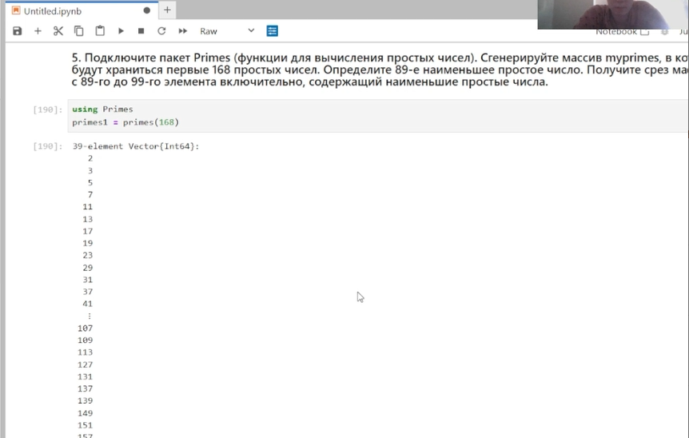{#fig:012 width=100% height=100%}

## 6. Вычислите следующие выражения

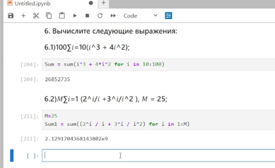{#fig:013 width=100% height=100%}

# Выводы

Мы изучили несколько структур данных, реализованных в Julia, и научились применять их и операции над ними для решения задач
