---
## Front matter
lang: ru-RU
title: "Компьютерный практикум по статистическому анализу данных. Лаб №3"
subtitle: "Управляющие структуры"
author:
  - Шаповалова Диана Дмитриевна
institute:
  - Российский университет дружбы народов, Москва, Россия
date: 28 ноября 2024

## i18n babel
babel-lang: russian
babel-otherlangs: english

## Formatting pdf
toc: false
toc-title: Содержание
slide_level: 2
aspectratio: 169
section-titles: true
theme: metropolis
header-includes:
 - \metroset{progressbar=frametitle,sectionpage=progressbar,numbering=fraction}
---

# Вводная часть

## Цель работы

Основная цель работы — освоить применение циклов функций и сторонних для Julia
пакетов для решения задач линейной алгебры и работы с матрицами.

# Выполнение лабораторной работы

## Циклы while и for

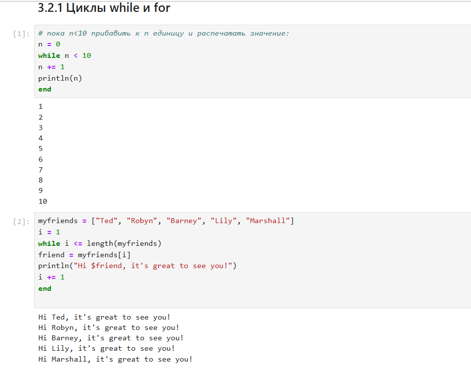{width=100% height=100%}

## Условные выражения

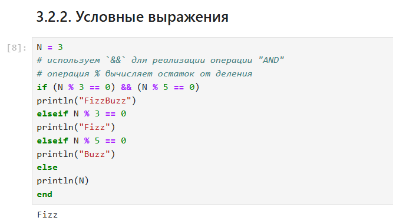{width=100% height=100%}

## Функции, Сторонние библиотеки (пакеты) в Julia

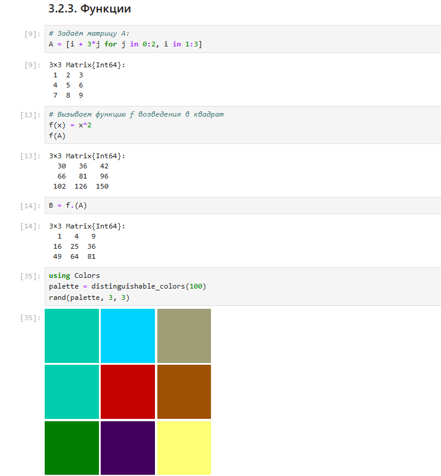{width=100% height=100%}

# Задания для самостоятельного выполнения

## 1. Используя циклы while и for: – выведите на экран целые числа от 1 до 100 и напечатайте их квадраты;

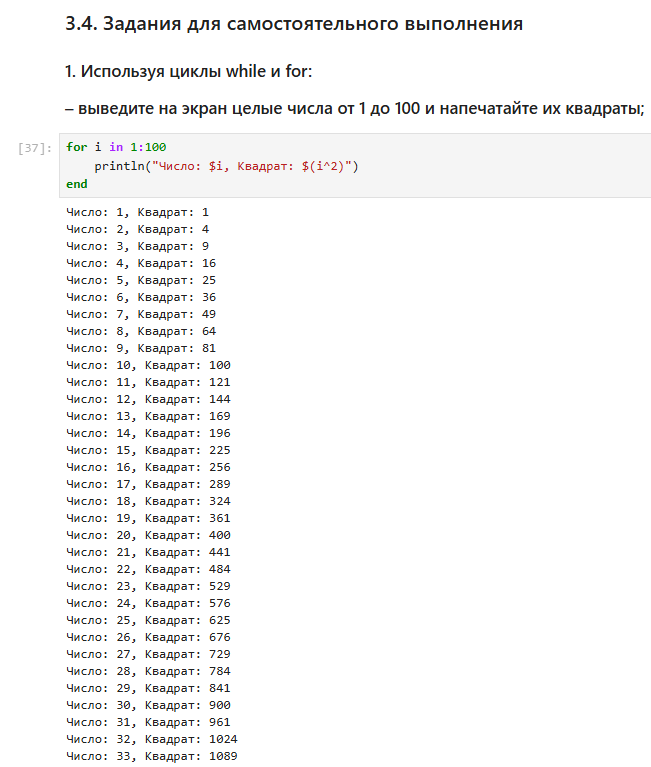{width=100% height=100%}

## – создайте словарь squares, который будет содержать целые числа в качестве ключей и квадраты в качестве их пар-значений; – создайте массив squares_arr, содержащий квадраты всех чисел от 1 до 100.

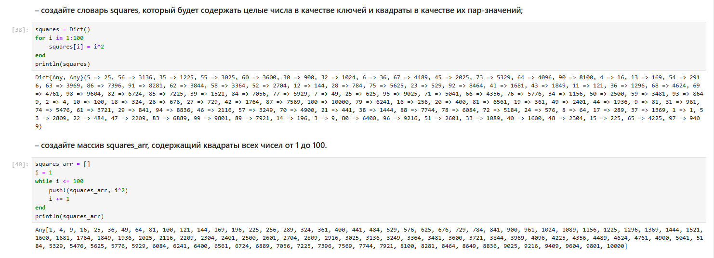{width=100% height=100%}

## 2. Напишите условный оператор, который печатает число, если число чётное, и строку «нечётное», если число нечётное. Перепишите код, используя тернарный оператор. 3. Напишите функцию add_one, которая добавляет 1 к своему входу.

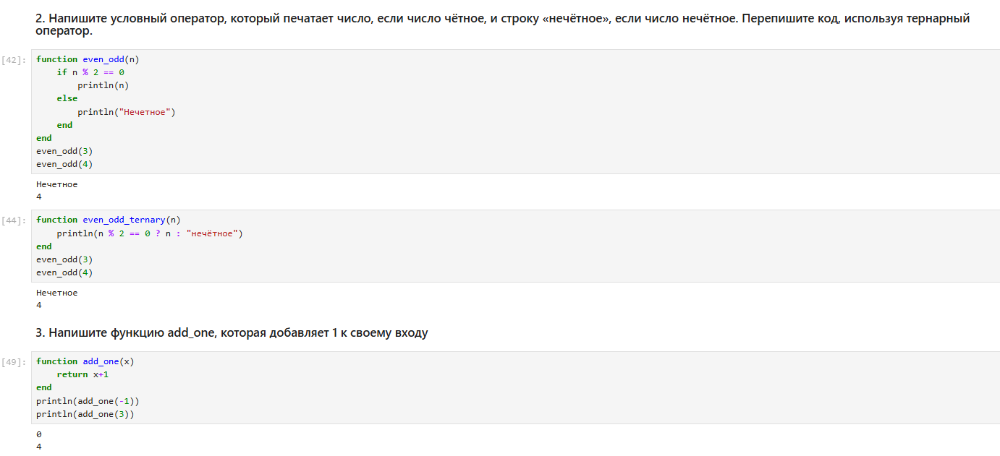{width=100% height=100%}

## 4. Используйте map() или broadcast() для задания матрицы 𝐴, каждый элемент которой увеличивается на единицу по сравнению с предыдущим.

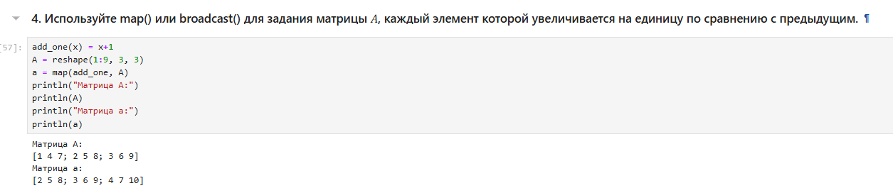{width=100% height=100%}

## 6. Создайте матрицу 𝐵 с элементами 𝐵𝑖1 = 10, 𝐵𝑖2 = −10, 𝐵𝑖3 = 10, 𝑖 = 1, 2, … , 15. Вычислите матрицу 𝐶 = 𝐵 * 𝐵^𝑇

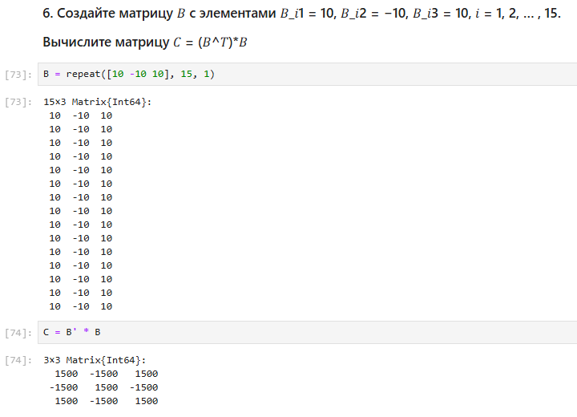{width=100% height=100%}

## 7. Создайте матрицу 𝑍 размерности 6 × 6, все элементы которой равны нулю, и матрицу 𝐸, все элементы которой равны 1. Используя цикл while или for и закономерности расположения элементов, создайте следующие матрицы размерности 6 × 6

{width=100% height=100%}

## 8. Напишите свою функцию, аналогичную функции outer() языка R.

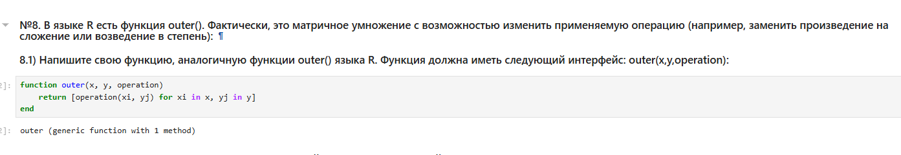{width=100% height=100%}

## Используя написанную вами функцию outer(), создайте матрицы следующей структуры

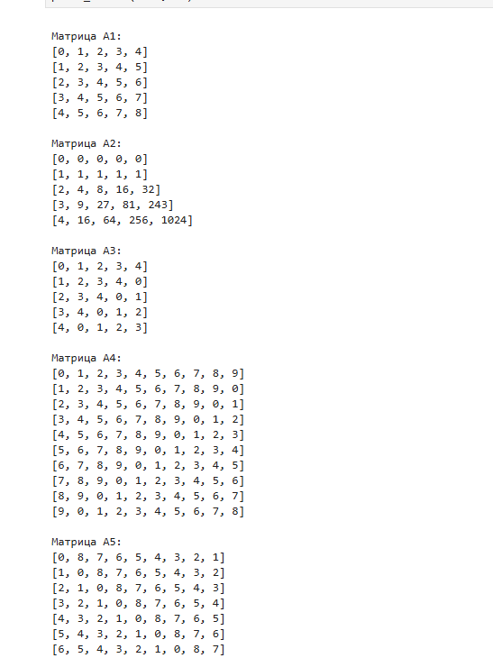{width=100% height=100%}

## 9. Решите следующую систему линейных уравнений с 5 неизвестными

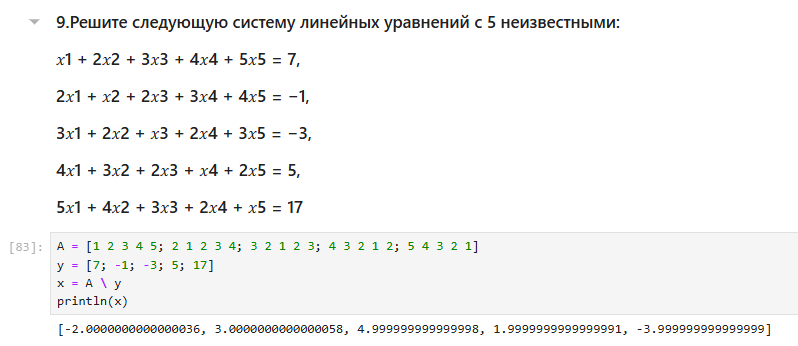{width=100% height=100%}

## 10. Создайте матрицу 𝑀 размерности 6 × 10, элементами которой являются целые числа, выбранные случайным образом с повторениями из совокупности 1, 2, … , 10.

– Найдите число элементов в каждой строке матрицы 𝑀, которые больше числа 𝑁
(например, 𝑁 = 4).

– Определите, в каких строках матрицы𝑀число𝑀(например,𝑀 = 7) встречается
ровно 2 раза?

## Задание 10

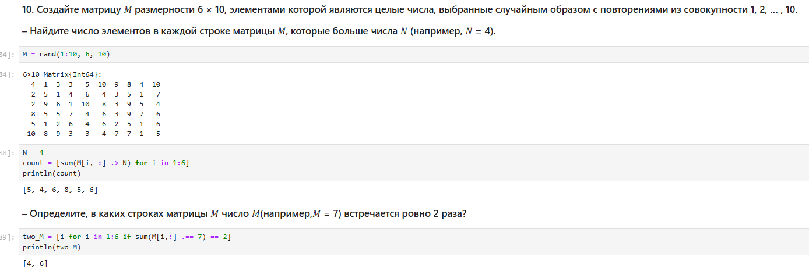{width=100% height=100%}

## – Определите все пары столбцов матрицы 𝑀, сумма элементов которых больше 𝐾 (например, 𝐾 = 75).

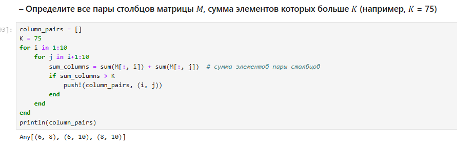{width=100% height=100%}

## 11. Вычислите

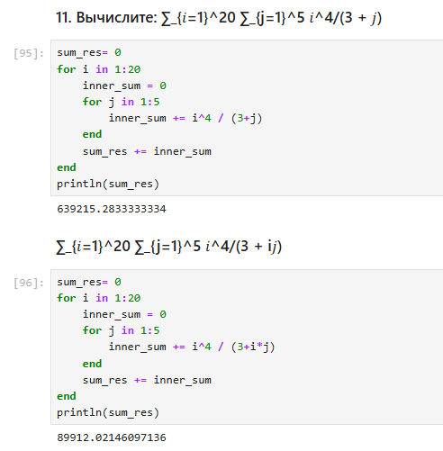{width=100% height=100%}

# Выводы

Мы освоили применение циклов функций и сторонних для Julia пакетов для решения задач линейной алгебры и работы с матрицами.
