---
## Front matter
title: "Отчёт по лабораторной работе №3 по дисциплине
Компьютерный практикум по статистическому анализу данных"
subtitle: "Управляющие структуры"
author: "Шаповалова Диана Дмитриевна"

## Generic otions
lang: ru-RU
toc-title: "Содержание"

## Bibliography
bibliography: bib/cite.bib
csl: pandoc/csl/gost-r-7-0-5-2008-numeric.csl

## Pdf output format
toc: true # Table of contents
toc-depth: 2
lof: true # List of figures
lot: true # List of tables
fontsize: 12pt
linestretch: 1.5
papersize: a4
documentclass: scrreprt
## I18n polyglossia
polyglossia-lang:
  name: russian
  options:
	- spelling=modern
	- babelshorthands=true
polyglossia-otherlangs:
  name: english
## I18n babel
babel-lang: russian
babel-otherlangs: english
## Fonts
mainfont: IBM Plex Serif
romanfont: IBM Plex Serif
sansfont: IBM Plex Sans
monofont: IBM Plex Mono
mathfont: STIX Two Math
mainfontoptions: Ligatures=Common,Ligatures=TeX,Scale=0.94
romanfontoptions: Ligatures=Common,Ligatures=TeX,Scale=0.94
sansfontoptions: Ligatures=Common,Ligatures=TeX,Scale=MatchLowercase,Scale=0.94
monofontoptions: Scale=MatchLowercase,Scale=0.94,FakeStretch=0.9
mathfontoptions:
## Biblatex
biblatex: true
biblio-style: "gost-numeric"
biblatexoptions:
  - parentracker=true
  - backend=biber
  - hyperref=auto
  - language=auto
  - autolang=other*
  - citestyle=gost-numeric
## Pandoc-crossref LaTeX customization
figureTitle: "Рис."
tableTitle: "Таблица"
listingTitle: "Листинг"
lofTitle: "Список иллюстраций"
lotTitle: "Список таблиц"
lolTitle: "Листинги"
## Misc options
indent: true
header-includes:
  - \usepackage{indentfirst}
  - \usepackage{float} # keep figures where there are in the text
  - \floatplacement{figure}{H} # keep figures where there are in the text
---

# Цель работы

Основная цель работы — освоить применение циклов функций и сторонних для Julia
пакетов для решения задач линейной алгебры и работы с матрицами.

# Выполнение лабораторной работы

## Циклы while и for

Для различных операций, связанных с перебором индексируемых элементов структур
данных, традиционно используются циклы while и for.
Например, while можно использовать для формирования элементов массива:

Другой пример демонстрирует использование while при работе со строковыми элементами массива, подставляя имя из массива в заданную строку приветствия и выводя
получившуюся конструкцию на экран

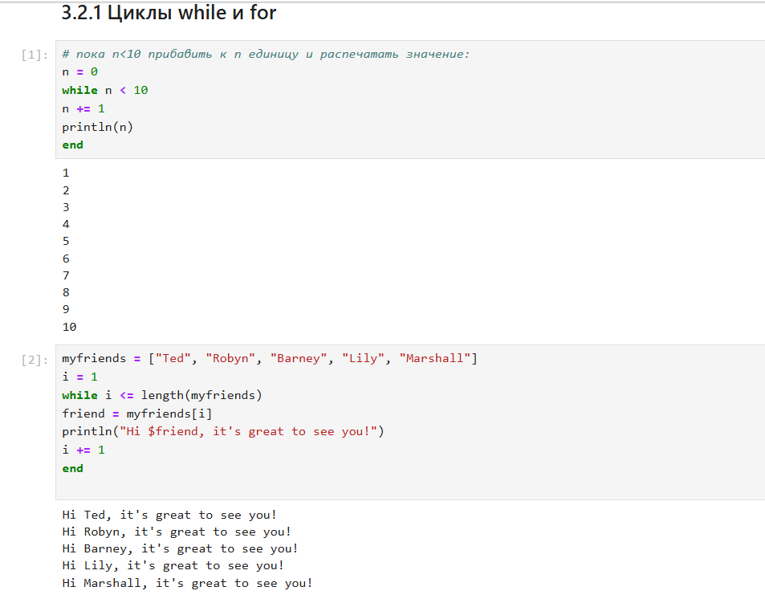{width=100% height=100%}

## Условные выражения

Довольно часто при решении задач требуется проверить выполнение тех или иных
условий. Для этого используют условные выражения.

Например, пусть для заданного числа 𝑁 требуется вывести слово «Fizz», если 𝑁 делится
на 3, «Buzz», если 𝑁 делится на 5, и «FizzBuzz», если 𝑁 делится на 3 и 5

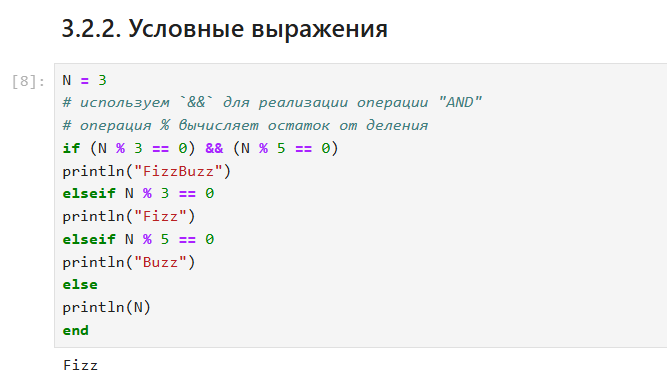{width=100% height=100%}

## Функции

Julia дает нам несколько разных способов написать функцию. Первый требует ключевых
слов function и end.

В Julia функция map является функцией высшего порядка, которая принимает функцию
в качестве одного из своих входных аргументов и применяет эту функцию к каждому
элементу структуры данных, которая ей передаётся также в качестве аргумента.

Функция broadcast — ещё одна функция высшего порядка в Julia, представляющая собой обобщение функции map.Функция broadcast() будет пытаться привести все объекты
к общему измерению, map() будет напрямую применять данную функцию поэлементно.
Синтаксис для вызова broadcast такой же, как и для вызова map.

## Сторонние библиотеки (пакеты) в Julia

Julia имеет более 2000 зарегистрированных пакетов, что делает их огромной частью
экосистемы Julia. Есть вызовы функций первого класса для других языков, обеспечивающие интерфейсы сторонних функций. Можно вызвать функции из Python или R,
например, с помощью PyCall или Rcall.

Например, добавим и загрузим пакет Colors, затем создадим палитру из 100 разных цветов, а затем определим матрицу 3 × 3 с элементами в форме случайного цвета из палитры,
используя функцию rand.

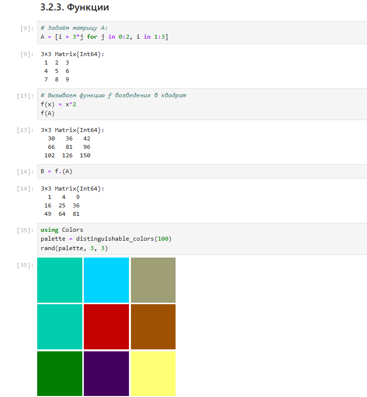{width=100% height=100%}

## Задания для самостоятельного выполнения

1. Используя циклы while и for:

– выведите на экран целые числа от 1 до 100 и напечатайте их квадраты;

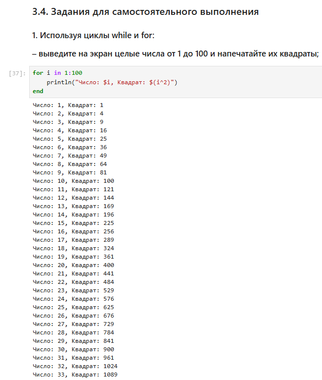{width=100% height=100%}

– создайте словарь squares, который будет содержать целые числа в качестве ключей и квадраты в качестве их пар-значений;

– создайте массив squares_arr, содержащий квадраты всех чисел от 1 до 100.

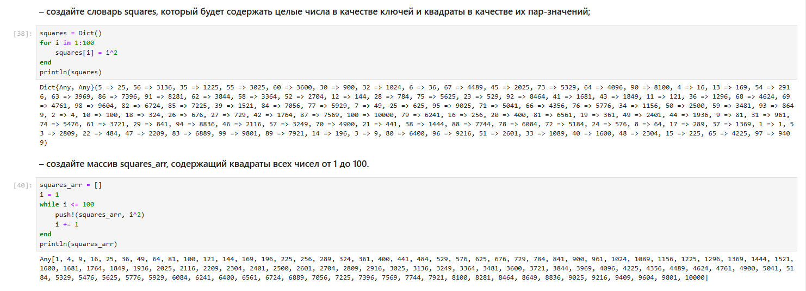{width=100% height=100%}

2. Напишите условный оператор, который печатает число, если число чётное, и строку «нечётное», если число нечётное. Перепишите код, используя тернарный оператор.

3. Напишите функцию add_one, которая добавляет 1 к своему входу.

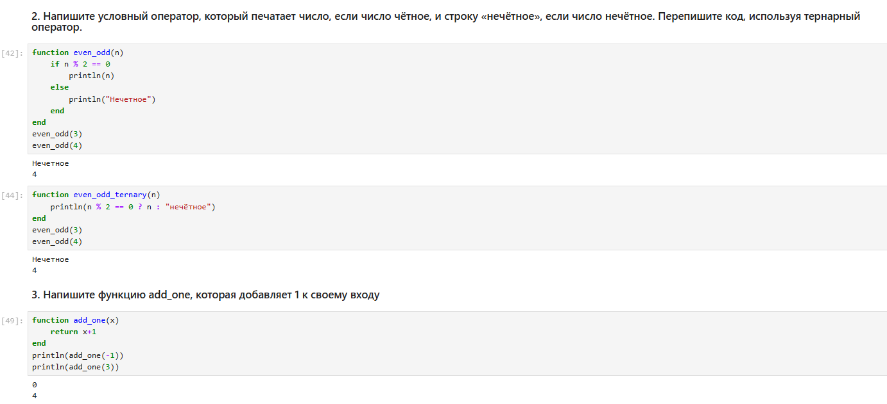{width=100% height=100%}

4. Используйте map() или broadcast() для задания матрицы 𝐴, каждый элемент которой увеличивается на единицу по сравнению с предыдущим.

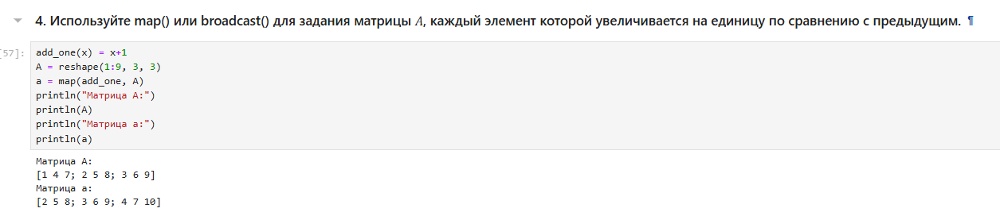{width=100% height=100%}

6. Создайте матрицу 𝐵 с элементами 𝐵𝑖1 = 10, 𝐵𝑖2 = −10, 𝐵𝑖3 = 10, 𝑖 = 1, 2, … , 15.

Вычислите матрицу 𝐶 = 𝐵 * 𝐵^𝑇

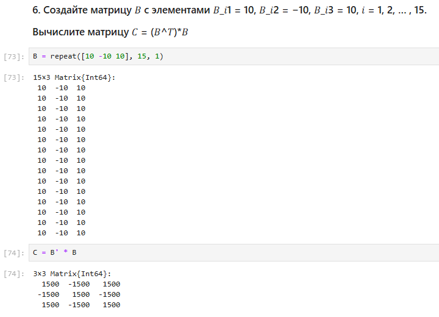{width=100% height=100%}

7. Создайте матрицу 𝑍 размерности 6 × 6, все элементы которой равны нулю, и матрицу
𝐸, все элементы которой равны 1. Используя цикл while или for и закономерности
расположения элементов, создайте следующие матрицы размерности 6 × 6

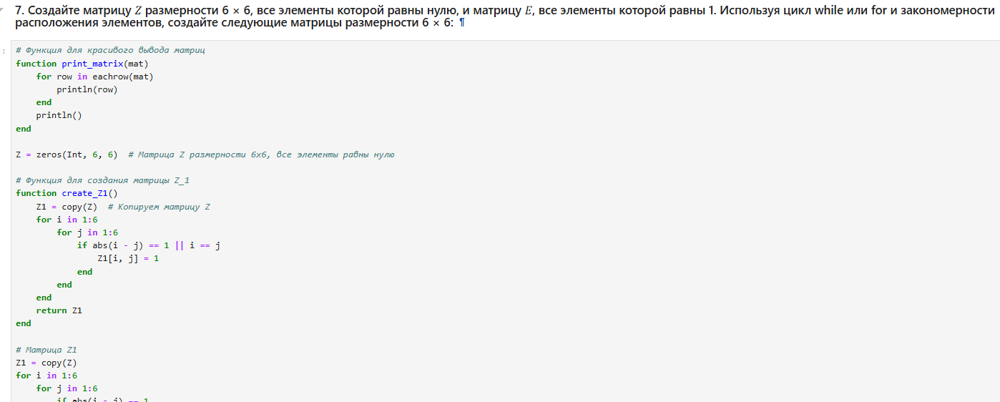{width=100% height=100%}

8. В языке R есть функция outer(). Фактически, это матричное умножение с возможностью изменить применяемую операцию (например, заменить произведение на
сложение или возведение в степень).

– Напишите свою функцию, аналогичную функции outer() языка R. Функция
должна иметь следующий интерфейс: outer(x,y,operation).

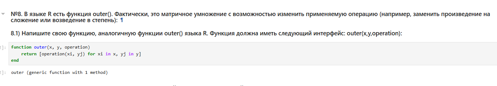{width=100% height=100%}

– Используя написанную вами функцию outer(), создайте матрицы следующей
структуры

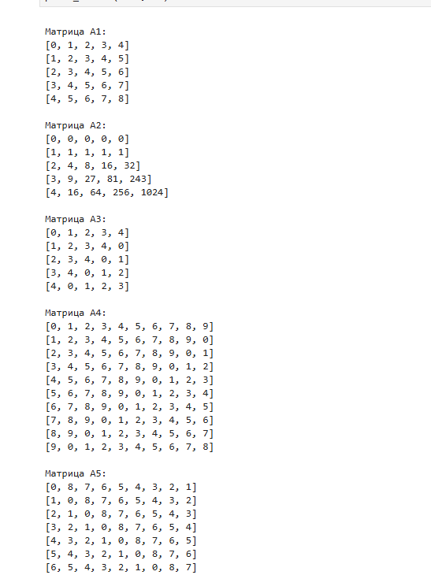{width=100% height=100%}

9. Решите следующую систему линейных уравнений с 5 неизвестными

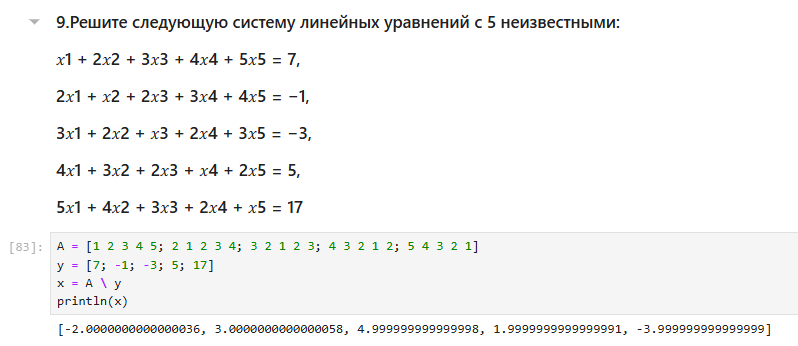{width=100% height=100%}

10. Создайте матрицу 𝑀 размерности 6 × 10, элементами которой являются целые числа,
выбранные случайным образом с повторениями из совокупности 1, 2, … , 10.

– Найдите число элементов в каждой строке матрицы 𝑀, которые больше числа 𝑁
(например, 𝑁 = 4).

– Определите, в каких строках матрицы𝑀число𝑀(например,𝑀 = 7) встречается
ровно 2 раза?

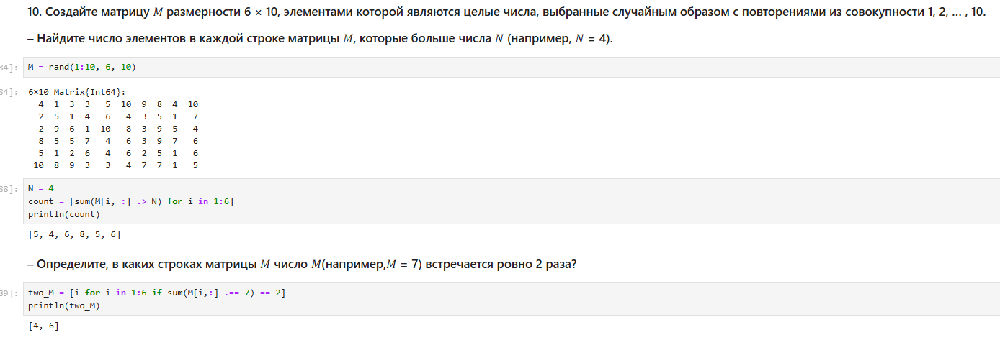{width=100% height=100%}

– Определите все пары столбцов матрицы 𝑀, сумма элементов которых больше 𝐾
(например, 𝐾 = 75).

{width=100% height=100%}

11. Вычислите

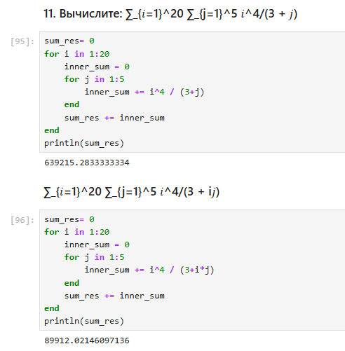{width=100% height=100%}

# Выводы

Мы освоили применение циклов функций и сторонних для Julia пакетов для решения задач линейной алгебры и работы с матрицами.

