---
## Front matter
lang: ru-RU
title: "Компьютерный практикум по статистическому анализу данных. Лаб №4"
subtitle: "Линейная алгебра"
author:
  - Шаповалова Диана Дмитриевна
institute:
  - Российский университет дружбы народов, Москва, Россия
date: 5 декабря 2024

## i18n babel
babel-lang: russian
babel-otherlangs: english

## Formatting pdf
toc: false
toc-title: Содержание
slide_level: 2
aspectratio: 169
section-titles: true
theme: metropolis
header-includes:
 - \metroset{progressbar=frametitle,sectionpage=progressbar,numbering=fraction}
---

# Вводная часть

## Цель работы

Основной целью работы является изучение возможностей специализированных пакетов Julia для выполнения и оценки эффективности операций над объектами линейной
алгебры

# Выполнение работы

## Поэлементные операции над многомерными массивами

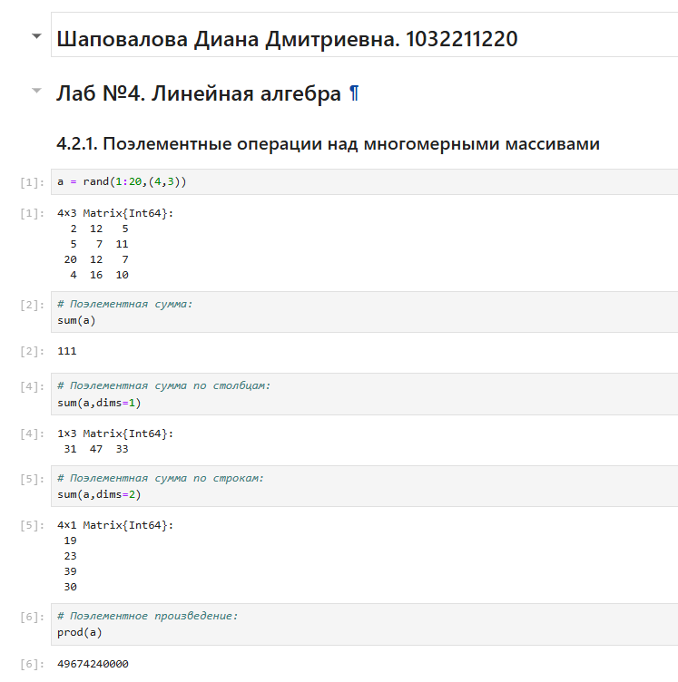{width=100% height=100%}

## Транспонирование, след, ранг, определитель и инверсия матрицы

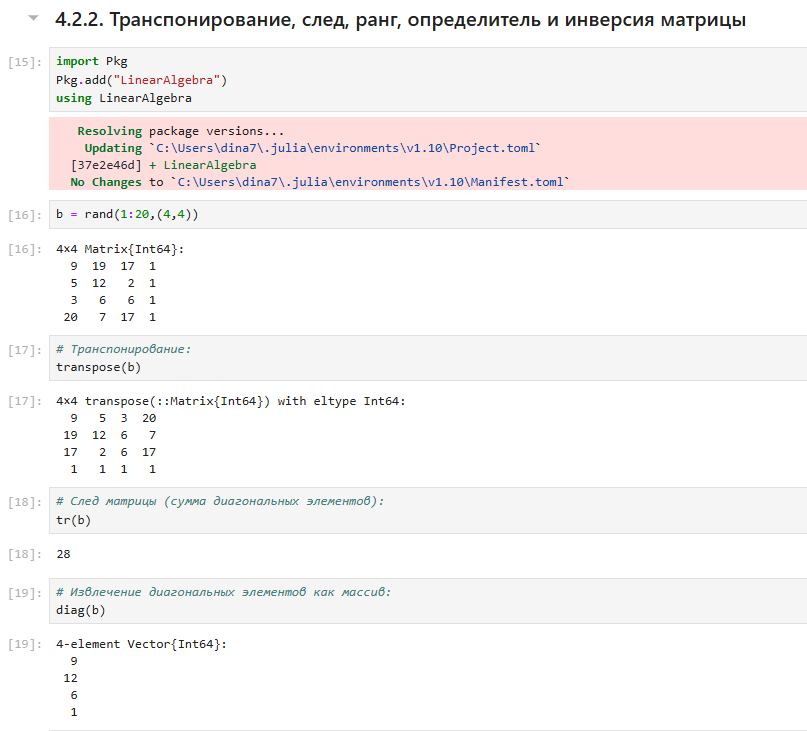{width=100% height=100%}

## Вычисление нормы векторов и матриц, повороты, вращения

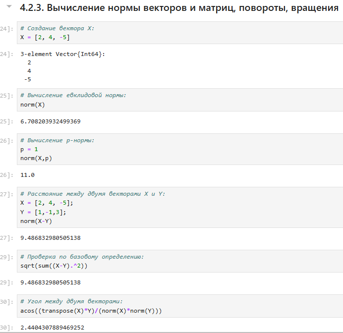{width=100% height=100%}

## Матричное умножение, единичная матрица, скалярное произведение

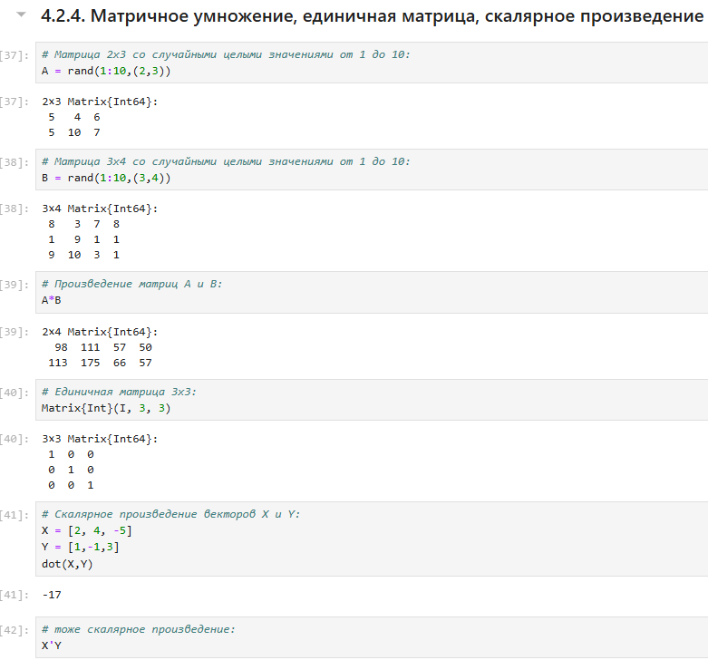{width=100% height=100%}

## Факторизация. Специальные матричные структуры

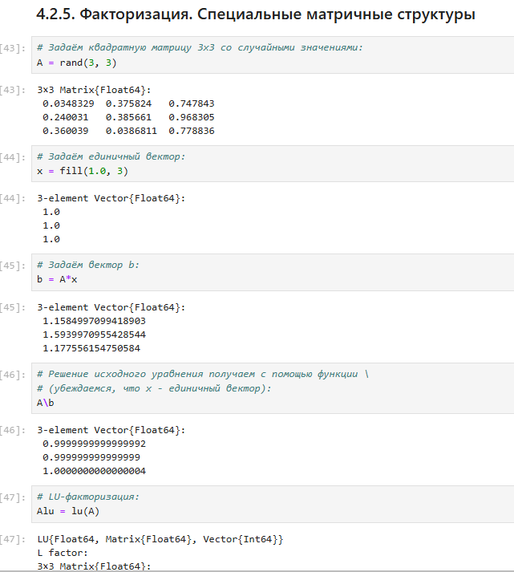{width=100% height=100%}

## Общая линейная алгебра

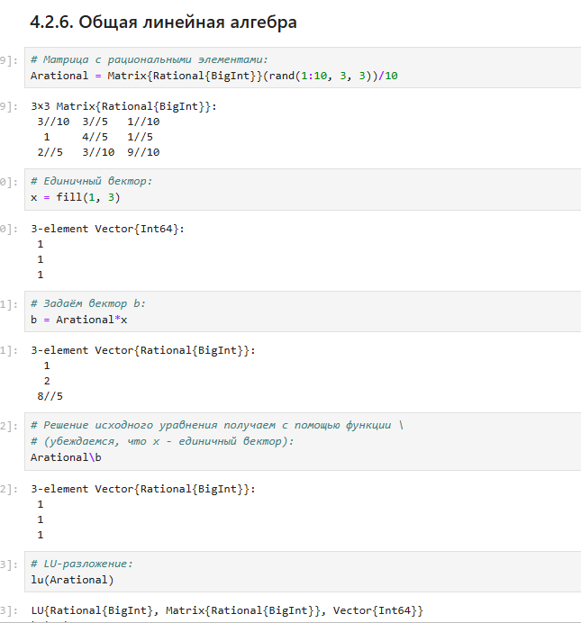{width=100% height=100%}

# Задания для самостоятельного выполнения

## Произведение векторов

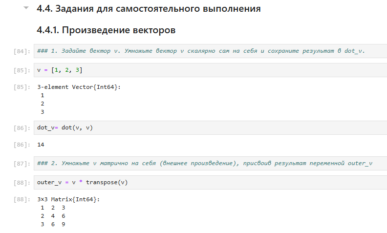{width=100% height=100%}

## Решить СЛАУ с двумя неизвестными

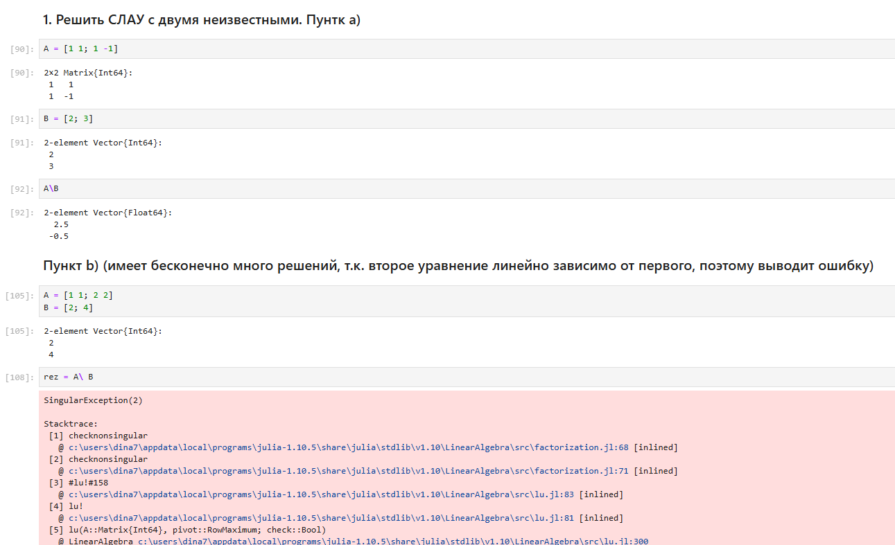{width=100% height=100%}

## Решить СЛАУ с двумя неизвестными

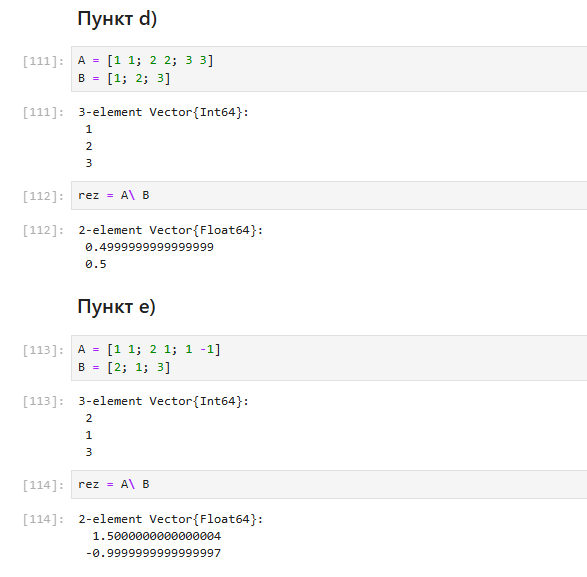{width=100% height=100%}

## Решить СЛАУ с тремя неизвестными

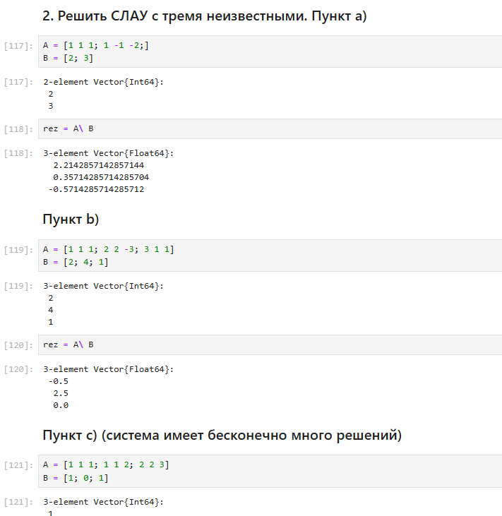{width=100% height=100%}

## Операции с матрицами. Приведите приведённые ниже матрицы к диагональному виду

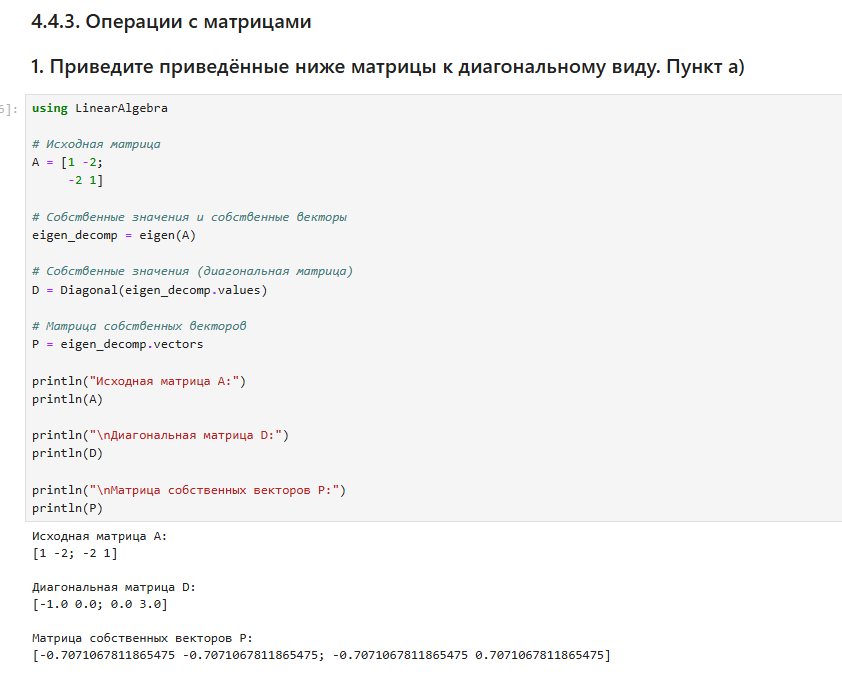{width=100% height=100%}

## Вычислите

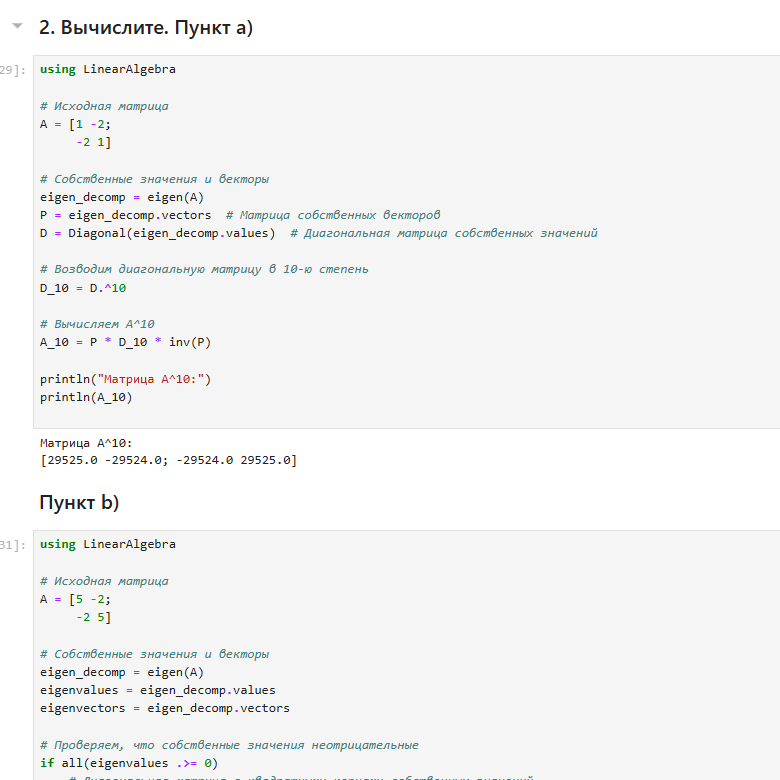{width=100% height=100%}

## Найдите собственные значения матрицы A. Создайте диагональную матрицу из собственных значений матрицы 𝐴. Создайте нижнедиагональную матрицу из матрица 𝐴. Оцените эффективность выполняемых операций.

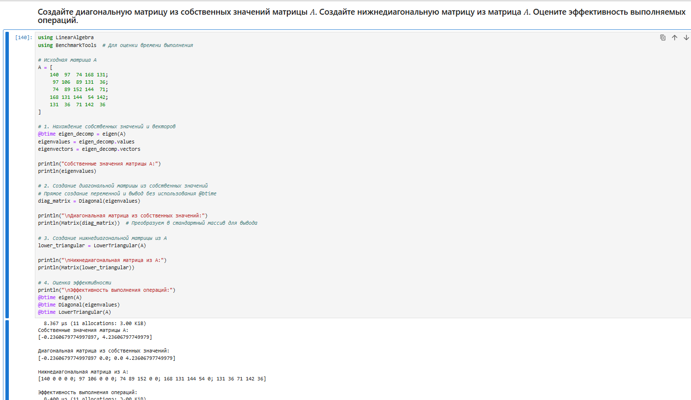{width=100% height=100%}

## Линейные модели экономики

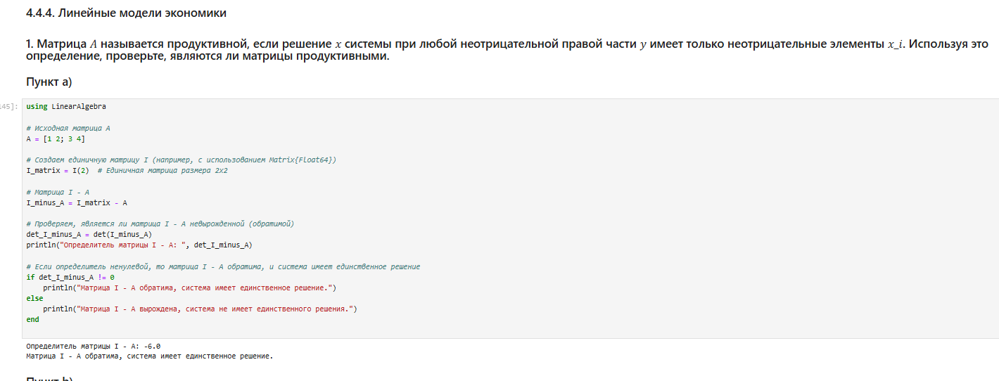{width=100% height=100%}

## Линейные модели экономики

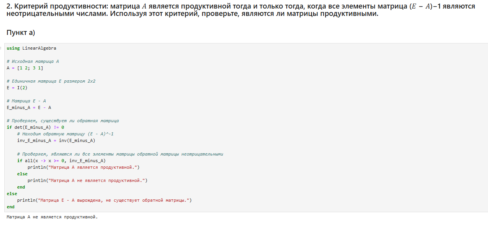{width=100% height=100%}

## Линейные модели экономики

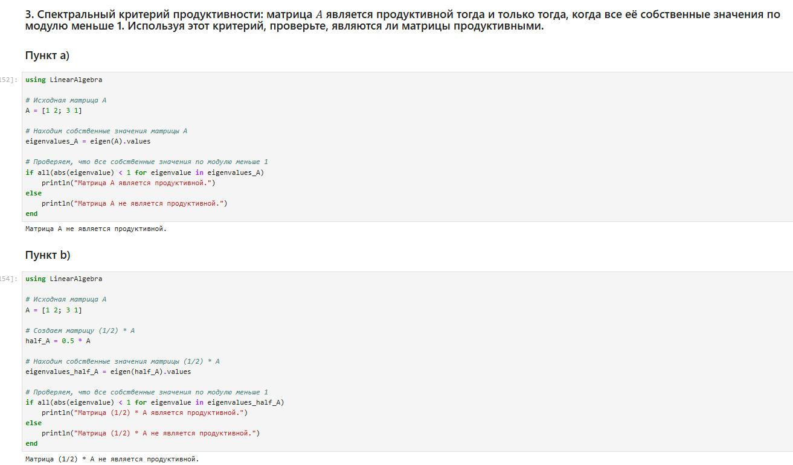{width=100% height=100%}

# Выводы

Мы изучили возможности специализированных пакетов Julia для выполнения и оценки эффективности операций над объектами линейной
алгебры

