---
## Front matter
title: "Отчёт по лабораторной работе №3 по дисциплине
Компьютерный практикум по статистическому анализу данных"
subtitle: "Линейная алгебра"
author: "Шаповалова Диана Дмитриевна"

## Generic otions
lang: ru-RU
toc-title: "Содержание"

## Bibliography
bibliography: bib/cite.bib
csl: pandoc/csl/gost-r-7-0-5-2008-numeric.csl

## Pdf output format
toc: true # Table of contents
toc-depth: 2
lof: true # List of figures
lot: true # List of tables
fontsize: 12pt
linestretch: 1.5
papersize: a4
documentclass: scrreprt
## I18n polyglossia
polyglossia-lang:
  name: russian
  options:
	- spelling=modern
	- babelshorthands=true
polyglossia-otherlangs:
  name: english
## I18n babel
babel-lang: russian
babel-otherlangs: english
## Fonts
mainfont: IBM Plex Serif
romanfont: IBM Plex Serif
sansfont: IBM Plex Sans
monofont: IBM Plex Mono
mathfont: STIX Two Math
mainfontoptions: Ligatures=Common,Ligatures=TeX,Scale=0.94
romanfontoptions: Ligatures=Common,Ligatures=TeX,Scale=0.94
sansfontoptions: Ligatures=Common,Ligatures=TeX,Scale=MatchLowercase,Scale=0.94
monofontoptions: Scale=MatchLowercase,Scale=0.94,FakeStretch=0.9
mathfontoptions:
## Biblatex
biblatex: true
biblio-style: "gost-numeric"
biblatexoptions:
  - parentracker=true
  - backend=biber
  - hyperref=auto
  - language=auto
  - autolang=other*
  - citestyle=gost-numeric
## Pandoc-crossref LaTeX customization
figureTitle: "Рис."
tableTitle: "Таблица"
listingTitle: "Листинг"
lofTitle: "Список иллюстраций"
lotTitle: "Список таблиц"
lolTitle: "Листинги"
## Misc options
indent: true
header-includes:
  - \usepackage{indentfirst}
  - \usepackage{float} # keep figures where there are in the text
  - \floatplacement{figure}{H} # keep figures where there are in the text
---

# Цель работы

Основной целью работы является изучение возможностей специализированных пакетов Julia для выполнения и оценки эффективности операций над объектами линейной
алгебры

# Выполнение работы
## Поэлементные операции над многомерными массивами

Для матрицы 4 × 3 рассмотрим поэлементные операции сложения и произведения её
элементов.

Для работы со средними значениями можно воспользоваться возможностями пакета
Statistics

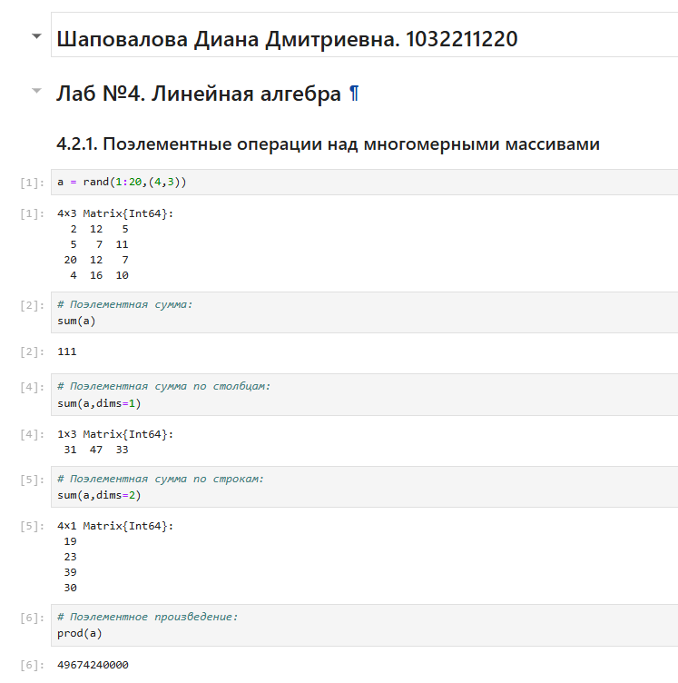{width=100% height=100%}

## Транспонирование, след, ранг, определитель и инверсия матрицы

Для выполнения таких операций над матрицами, как транспонирование, диагонализация, определение следа, ранга, определителя матрицы и т.п. можно воспользоваться
библиотекой (пакетом) LinearAlgebra

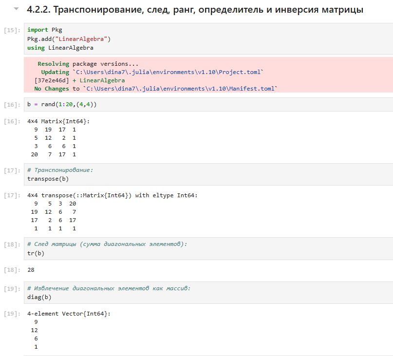{width=100% height=100%}

## Вычисление нормы векторов и матриц, повороты, вращения

Для вычисления нормы используется LinearAlgebra.norm(x).

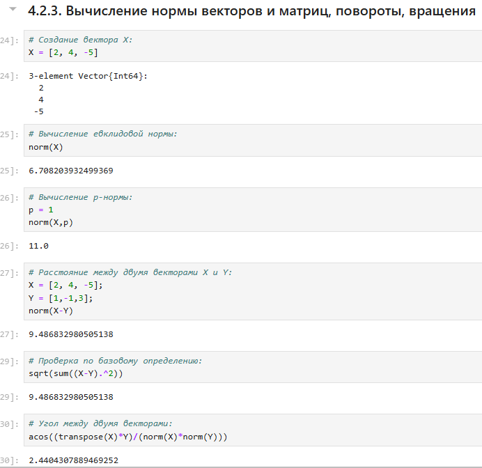{width=100% height=100%}

## Матричное умножение, единичная матрица, скалярное произведение

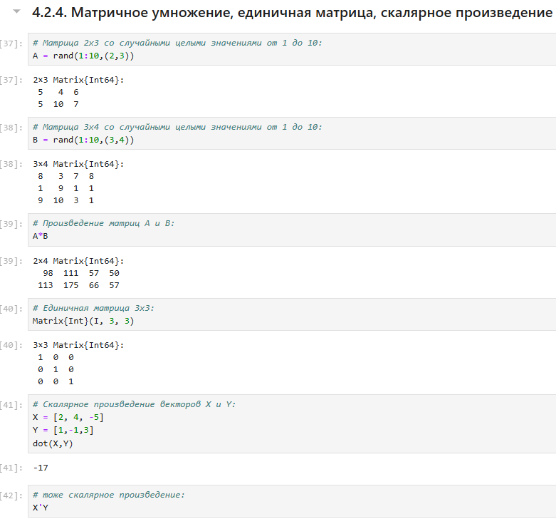{width=100% height=100%}

## Факторизация. Специальные матричные структуры

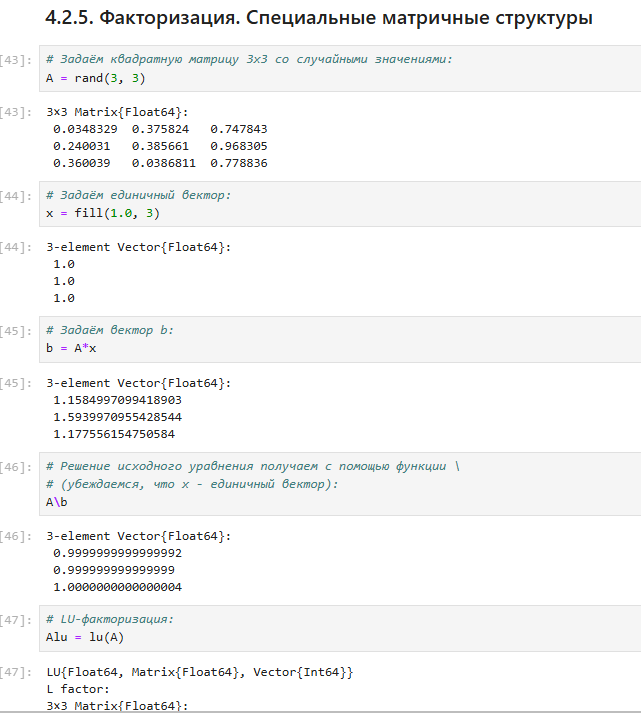{width=100% height=100%}

## Общая линейная алгебра

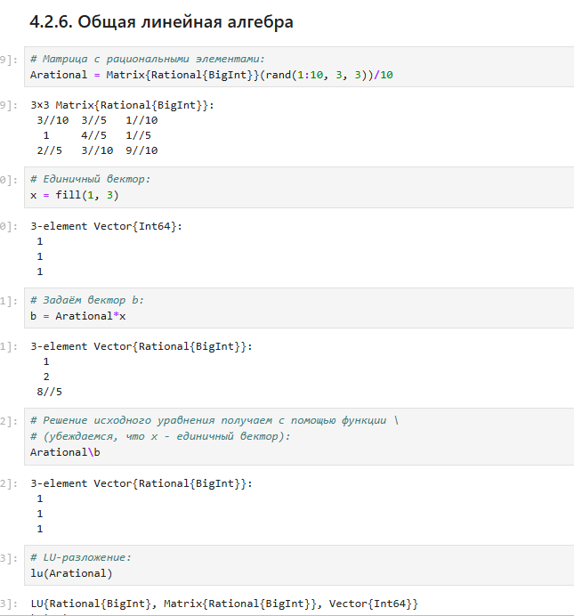{width=100% height=100%}

## Задания для самостоятельного выполнения
## Произведение векторов

1. Задайте вектор v. Умножьте вектор v скалярно сам на себя и сохраните результат
в dot_v.

2. Умножьте v матрично на себя (внешнее произведение), присвоив результат переменной outer_v.

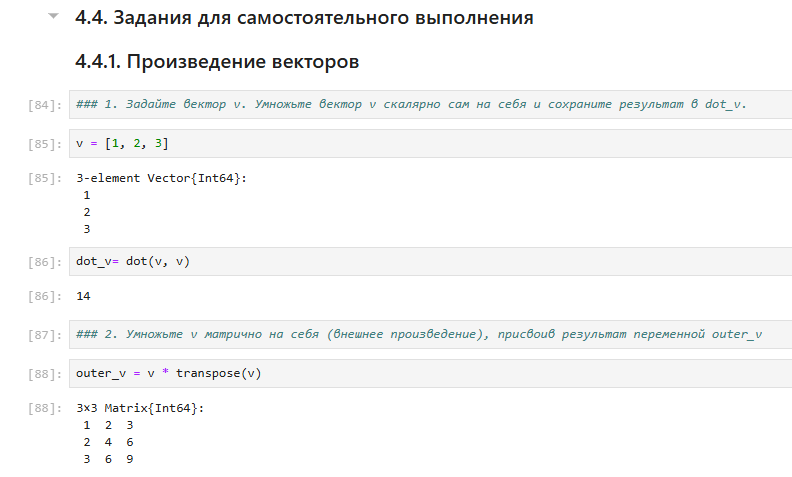{width=100% height=100%}

## Системы линейных уравнений

1. Решить СЛАУ с двумя неизвестными

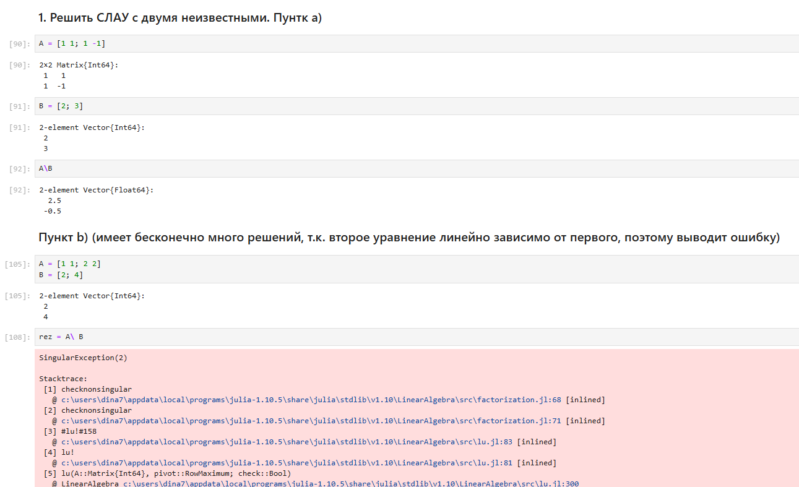{width=100% height=100%}

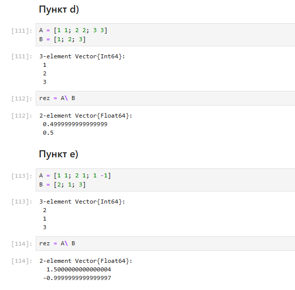{width=100% height=100%}

2. Решить СЛАУ с тремя неизвестными

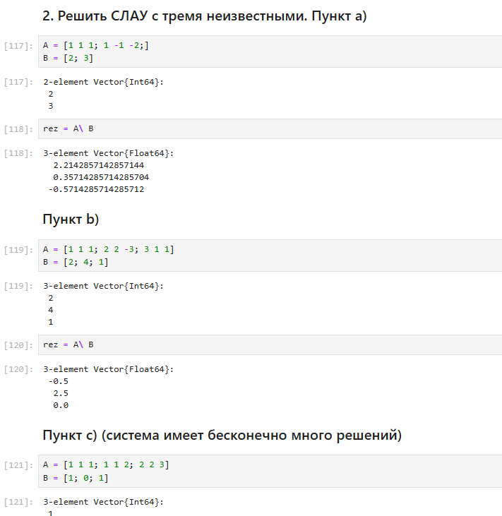{width=100% height=100%}

## Операции с матрицами

1. Приведите приведённые ниже матрицы к диагональному виду

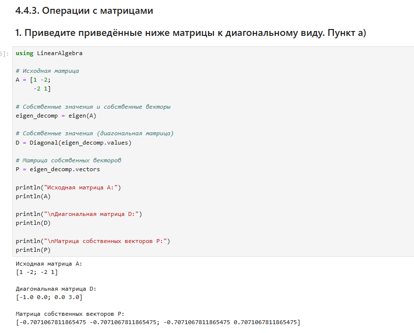{width=100% height=100%}

2. Вычислите

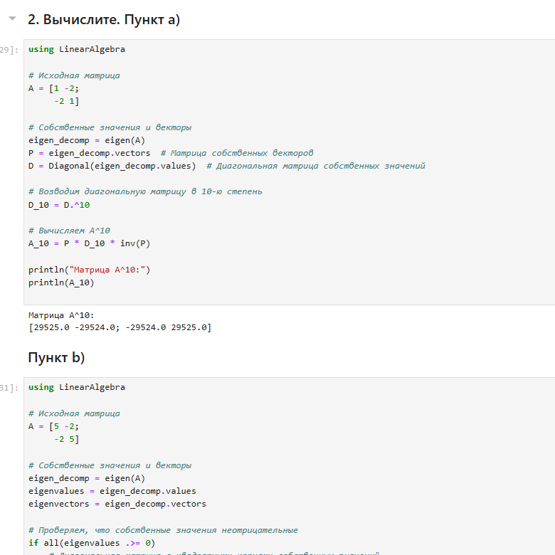{width=100% height=100%}

3. Найдите собственные значения матрицы A. Создайте диагональную матрицу из собственных значений матрицы 𝐴. Создайте
нижнедиагональную матрицу из матрица 𝐴. Оцените эффективность выполняемых
операций.

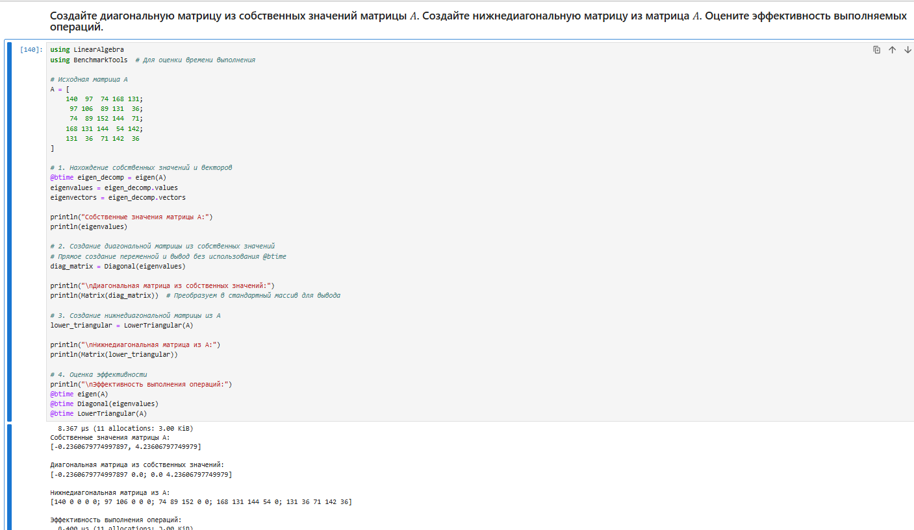{width=100% height=100%}

## Линейные модели экономики

Линейная модель экономики может быть записана как СЛАУ 𝑥 − 𝐴𝑥 = 𝑦,
где элементы матрицы 𝐴 и столбца 𝑦 — неотрицательные числа. По своему смыслу в экономике элементы матрицы 𝐴 и столбцов 𝑥, 𝑦 не могут быть отрицательными числами.

1. Матрица 𝐴 называется продуктивной, если решение 𝑥 системы при любой неотрицательной правой части 𝑦 имеет только неотрицательные элементы 𝑥_𝑖. Используя это
определение, проверьте, являются ли матрицы продуктивными.

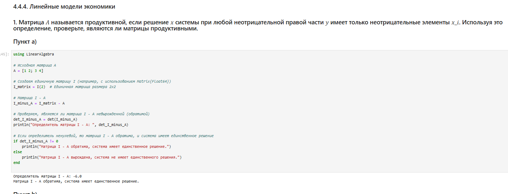{width=100% height=100%}

2. Критерий продуктивности: матрица 𝐴 является продуктивной тогда и только тогда,
когда все элементы матрица (𝐸 − 𝐴)^−1 являются неотрицательными числами. Используя этот критерий, проверьте, являются
ли матрицы продуктивными.

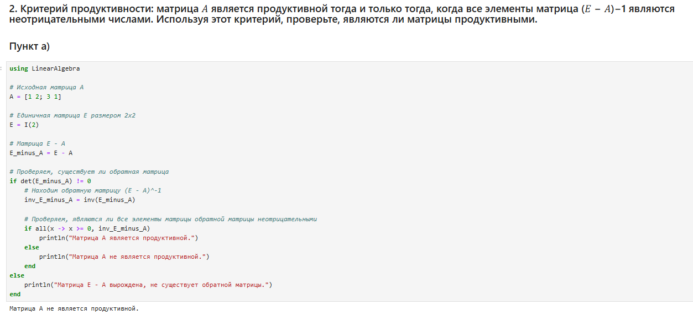{width=100% height=100%}

3. Спектральный критерий продуктивности: матрица 𝐴 является продуктивной тогда
и только тогда, когда все её собственные значения по модулю меньше 1. Используя
этот критерий, проверьте, являются ли матрицы продуктивными.

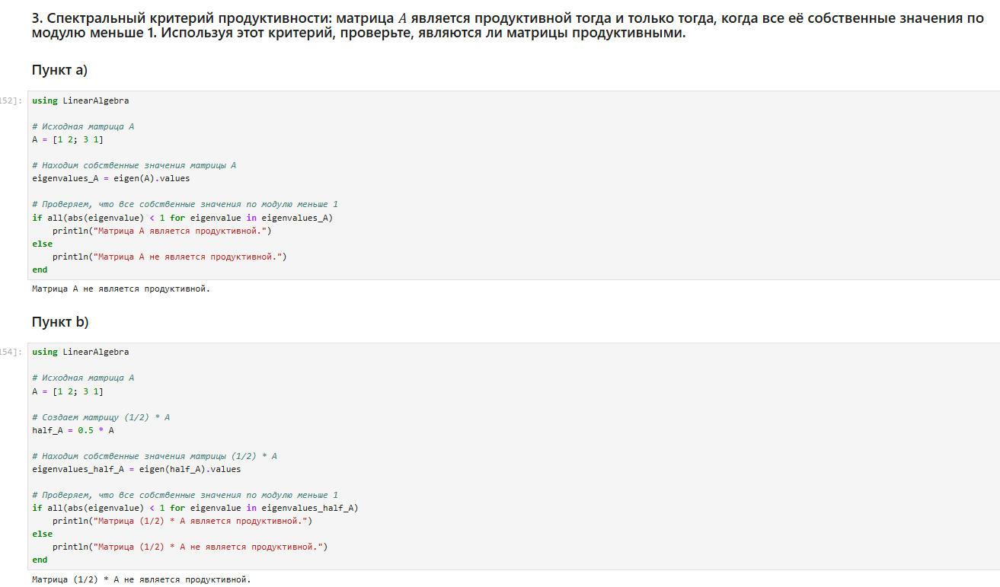{width=100% height=100%}

# Выводы

Мы изучили возможности специализированных пакетов Julia для выполнения и оценки эффективности операций над объектами линейной
алгебры

