---
## Front matter
lang: ru-RU
title: "Компьютерный практикум по статистическому анализу данных. Лаб №5"
subtitle: "Построение графиков"
author:
  - Шаповалова Диана Дмитриевна
institute:
  - Российский университет дружбы народов, Москва, Россия
date: 12 декабря 2024

## i18n babel
babel-lang: russian
babel-otherlangs: english

## Formatting pdf
toc: false
toc-title: Содержание
slide_level: 2
aspectratio: 169
section-titles: true
theme: metropolis
header-includes:
 - \metroset{progressbar=frametitle,sectionpage=progressbar,numbering=fraction}
---

# Вводная часть

## Цель работы

Основной целью работы является изучение возможностей специализированных пакетов Julia для выполнения и оценки эффективности операций над объектами линейной
алгебры

# Выполнение работы

## Основные пакеты для работы с графиками в Julia

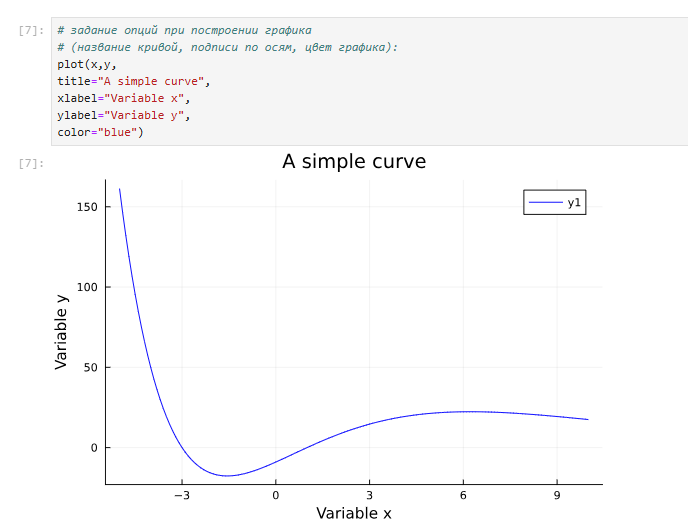{width=100% height=100%}

## Опции при построении графика

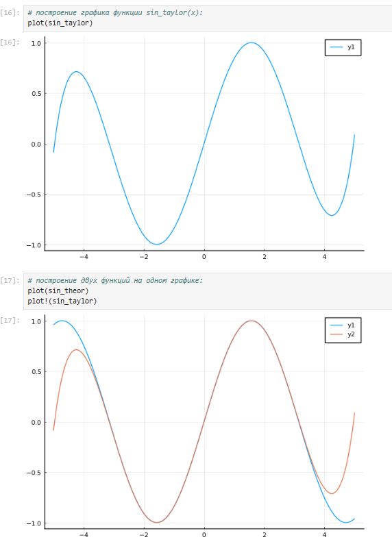{width=100% height=100%}

## Опции при построении графика

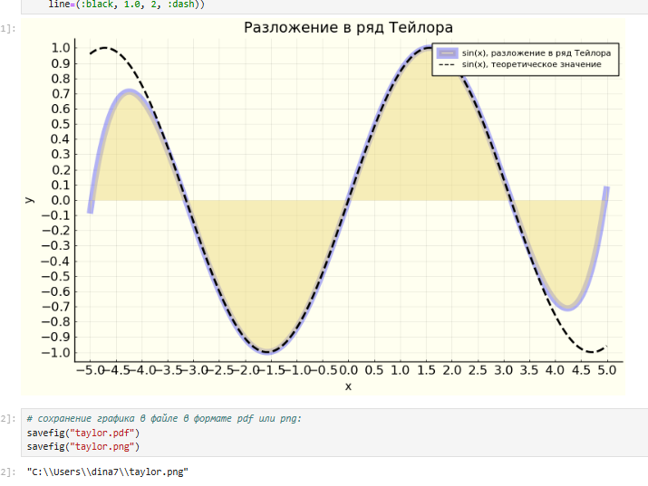{width=100% height=100%}

## Точечный график

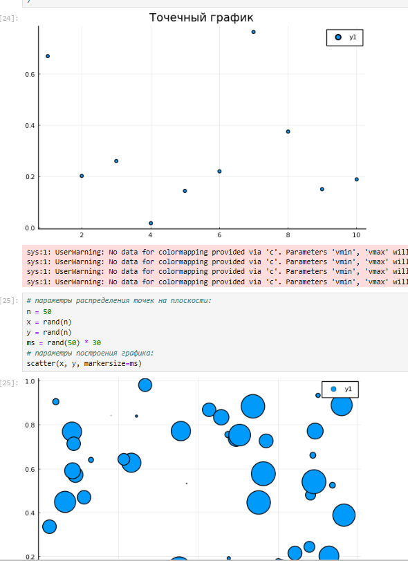{width=100% height=100%}

## Точечный график

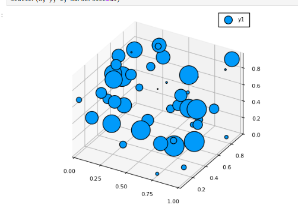{width=100% height=100%}

## Аппроксимация данных

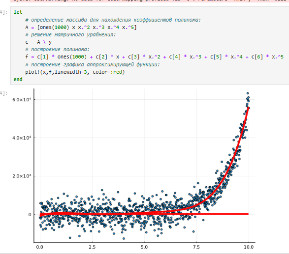{width=100% height=100%}

## Полярные координаты

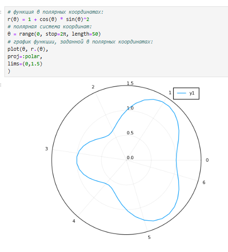{width=100% height=100%}

## Параметрический график

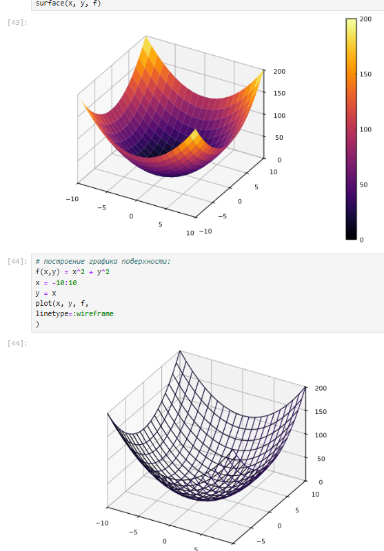{width=100% height=100%}

## Параметрический график

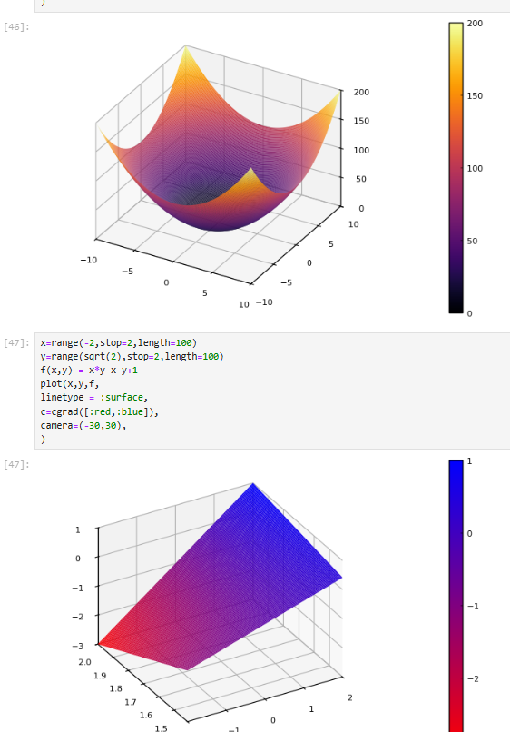{width=100% height=100%}

## Линии уровня

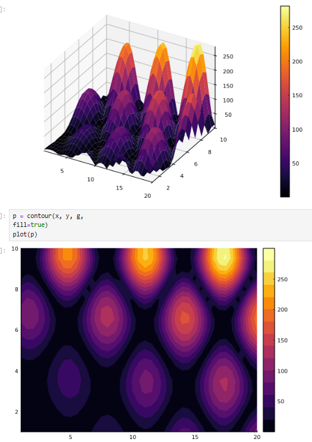{width=100% height=100%}

## Векторные поля

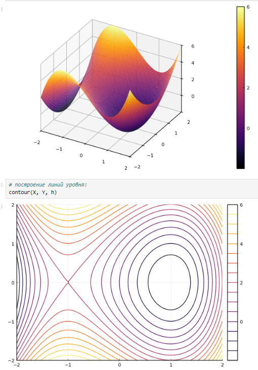{width=100% height=100%}

## Анимация

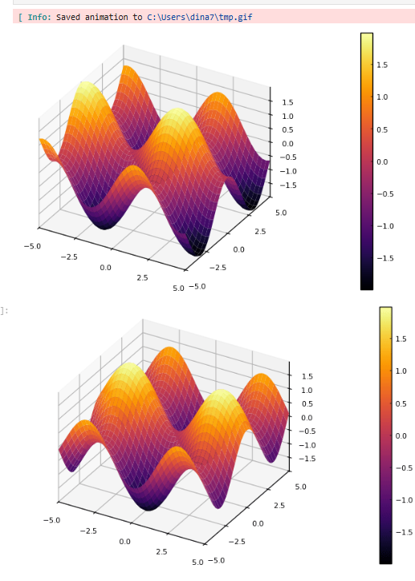{width=100% height=100%}

## Гипоциклоида

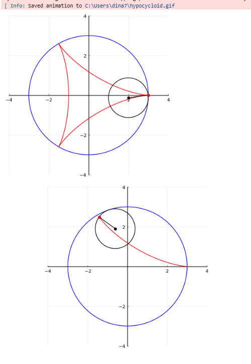{width=100% height=100%}

## Использование пакета Distributions

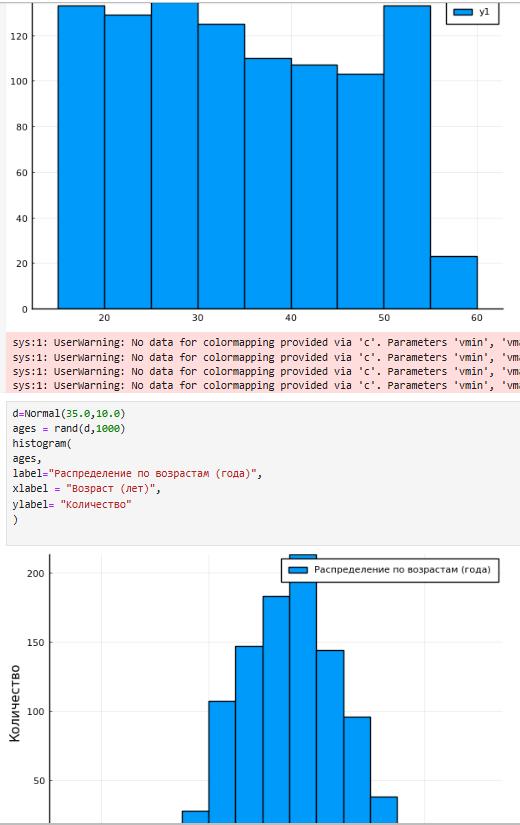{width=100% height=100%}

## Подграфики

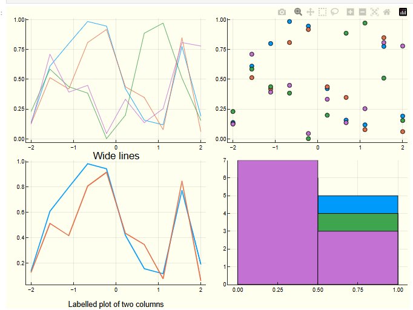{width=100% height=100%}

# Задания для самостоятельного выполнения
## Задание 1

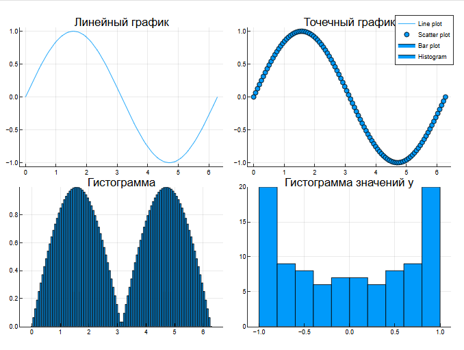{width=100% height=100%}

## Задание 2

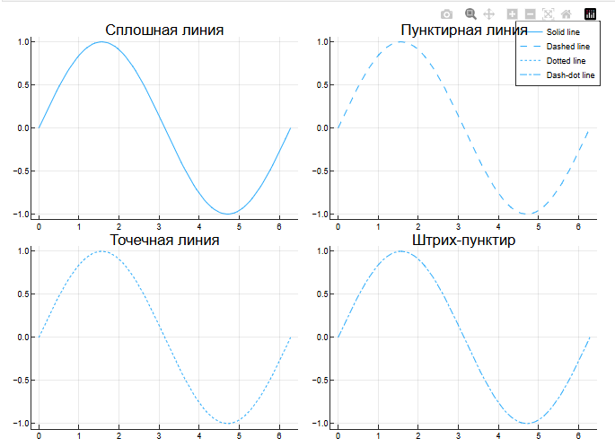{width=100% height=100%}

## Задание 3

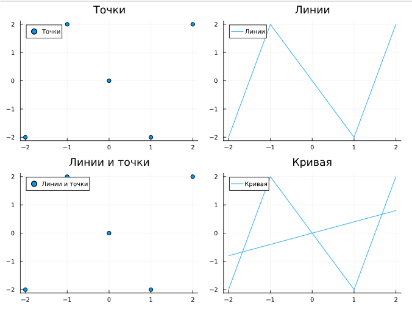{width=100% height=100%}

## Задание 6

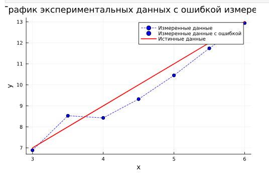{width=100% height=100%}

## Задание 8

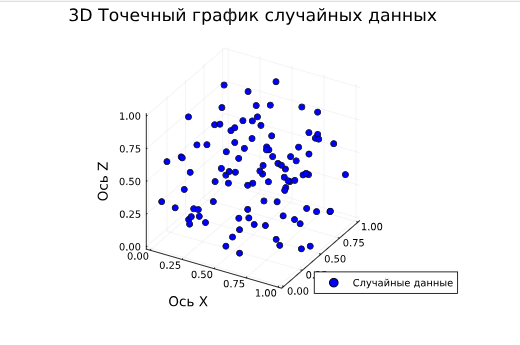{width=100% height=100%}

# Выводы 

Мы освоиили синтаксис языка Julia для построения графиков.
