---
## Front matter
title: "Отчёт по лабораторной работе №5 по дисциплине
Компьютерный практикум по статистическому анализу данных"
subtitle: "Построение графиков"
author: "Шаповалова Диана Дмитриевна"

## Generic otions
lang: ru-RU
toc-title: "Содержание"

## Bibliography
bibliography: bib/cite.bib
csl: pandoc/csl/gost-r-7-0-5-2008-numeric.csl

## Pdf output format
toc: true # Table of contents
toc-depth: 2
lof: true # List of figures
lot: true # List of tables
fontsize: 12pt
linestretch: 1.5
papersize: a4
documentclass: scrreprt
## I18n polyglossia
polyglossia-lang:
  name: russian
  options:
	- spelling=modern
	- babelshorthands=true
polyglossia-otherlangs:
  name: english
## I18n babel
babel-lang: russian
babel-otherlangs: english
## Fonts
mainfont: IBM Plex Serif
romanfont: IBM Plex Serif
sansfont: IBM Plex Sans
monofont: IBM Plex Mono
mathfont: STIX Two Math
mainfontoptions: Ligatures=Common,Ligatures=TeX,Scale=0.94
romanfontoptions: Ligatures=Common,Ligatures=TeX,Scale=0.94
sansfontoptions: Ligatures=Common,Ligatures=TeX,Scale=MatchLowercase,Scale=0.94
monofontoptions: Scale=MatchLowercase,Scale=0.94,FakeStretch=0.9
mathfontoptions:
## Biblatex
biblatex: true
biblio-style: "gost-numeric"
biblatexoptions:
  - parentracker=true
  - backend=biber
  - hyperref=auto
  - language=auto
  - autolang=other*
  - citestyle=gost-numeric
## Pandoc-crossref LaTeX customization
figureTitle: "Рис."
tableTitle: "Таблица"
listingTitle: "Листинг"
lofTitle: "Список иллюстраций"
lotTitle: "Список таблиц"
lolTitle: "Листинги"
## Misc options
indent: true
header-includes:
  - \usepackage{indentfirst}
  - \usepackage{float} # keep figures where there are in the text
  - \floatplacement{figure}{H} # keep figures where there are in the text
---

# Цель работы

Основная цель работы — освоить синтаксис языка Julia для построения графиков.

# Выполнение работы
## Основные пакеты для работы с графиками в Julia

Julia поддерживает несколько пакетов для работы с графиками. Использование того или иного пакета зависит от целей, преследуемых пользователем при построении.
Стандартным для Julia является пакет Plots.jl.

Перед использованием графических пакетов следует их установить и подключить
в Julia:

using Pkg

Pkg.add("Plots")

Pkg.add("PyPlot")

Pkg.add("Plotly")

Pkg.add("UnicodePlots")

using Plots

Стандартным образом можно задать различные опции при построении графика.
В результате получим график исходной функции 

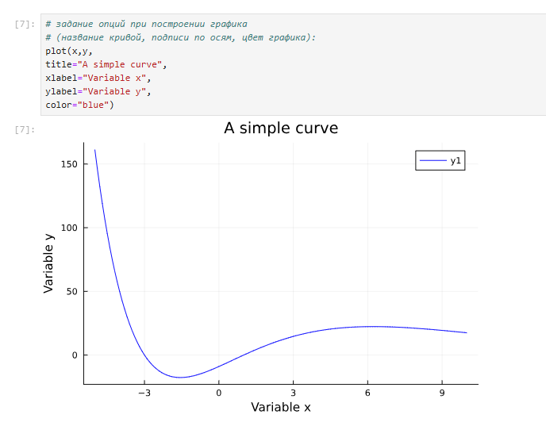{width=100% height=100%}

## Опции при построении графика

Задаём функцию

Строим график функции (рис. 5.3)

Задаём разложение исходной функции в ряд Тейлора

Строим график разложения исходной функции в ряд Тейлора

Выводим две функции на один график (рис. 5.5):

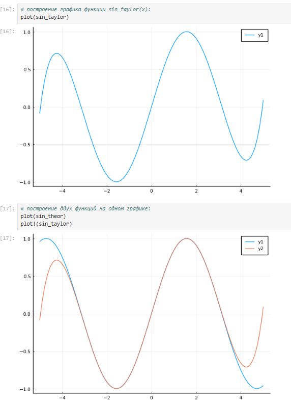{width=100% height=100%}

Далее добавим различные опции для отображения на графике

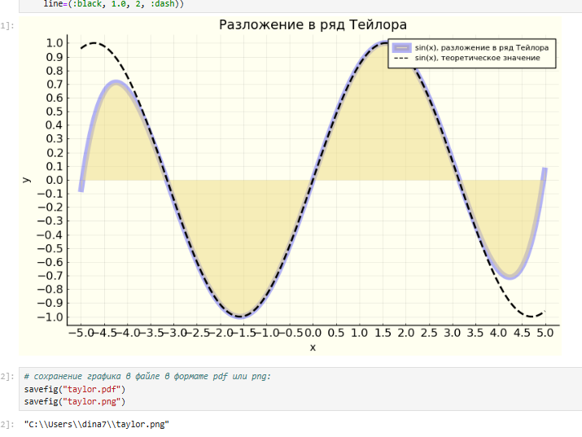{width=100% height=100%}

## Точечный график

Графики в виде точек на плоскости или в пространстве часто используются в статистических исследованиях.

Как и построении обычного графика для точечного графика необходимо задать массив
значений 𝑥, посчитать или задать значения 𝑦, задать опции построения графика.

Для точечного графика можно задать различные опции, например размер маркера,
его тип, цвет и и т.п.

{width=100% height=100%}

Можно строить и 3-мерные точечные графики

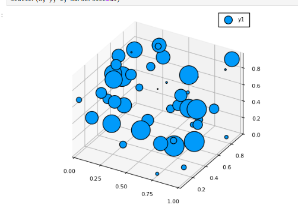{width=100% height=100%}

## Аппроксимация данных

Для демонстрации зададим искусственно некоторую функцию, в данном случае похожую по поведению на экспоненту.
Аппроксимируем полученную функцию полиномом 5-й степени.

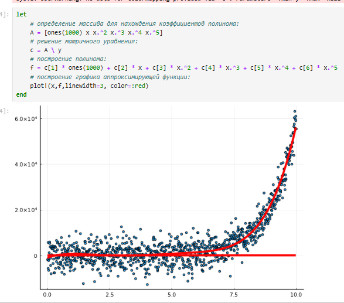{width=100% height=100%}

## Полярные координаты

Приведём пример построения графика функции 𝑟(𝜗) = 1 + cos 𝜗 sin2 𝜗 в полярных координатах

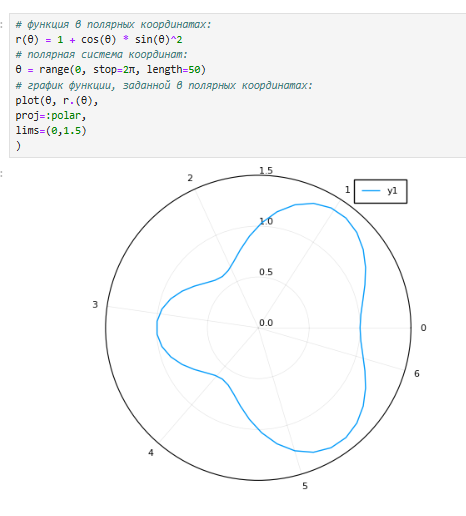{width=100% height=100%}

## Параметрический график

Для построения поверхности, заданной уравнением 𝑓(𝑥, 𝑦) = 𝑥^2 + 𝑦^2, можно воспользоваться функцией surface(). Также можно воспользоваться функцией plot() с заданными параметрами. Можно задать параметры сглаживания.
Можно задать определённый угол зрения.

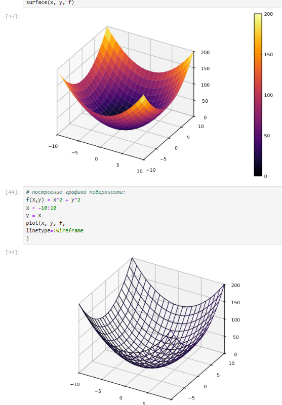{width=100% height=100%}

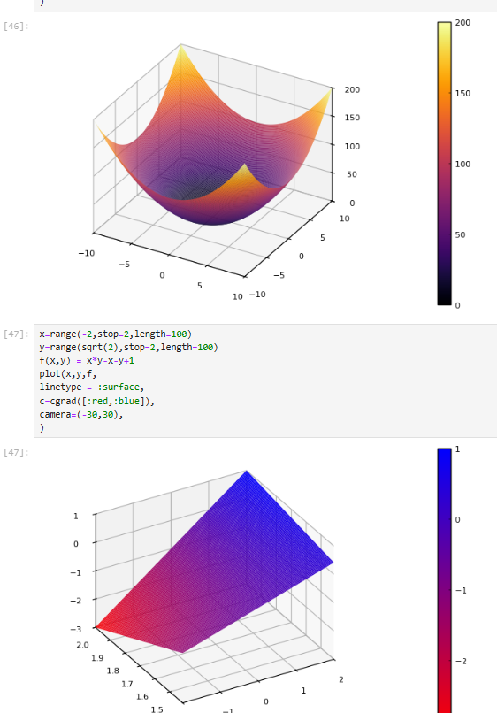{width=100% height=100%}

## Линии уровня

С помощью линий уровня можно определить наибольшее и наименьшее значение
исходной функции от двух переменных. Каждая из этих линий соответствует определённому значению высоты.
Поверхности уровня представляют собой непересекающиеся пространственные поверхности.
Рассмотрим поверхность, заданную функцией. Линии уровня можно построить, используя проекцию значений исходной функции на
плоскость. Можно дополнительно добавить заливку цветом

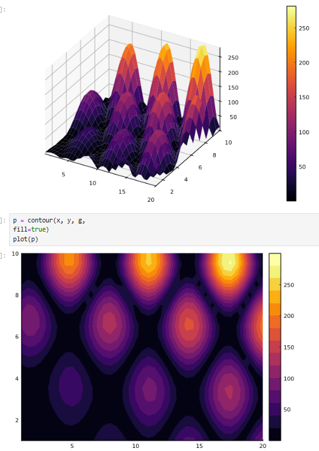{width=100% height=100%}

## Векторные поля

Если каждой точке некоторой области пространства поставлен в соответствие вектор
с началом в данной точке, то говорят, что в этой области задано векторное поле.
Векторные поля задают векторными функциями.
Для функции сначала построим её график и линии уровня.

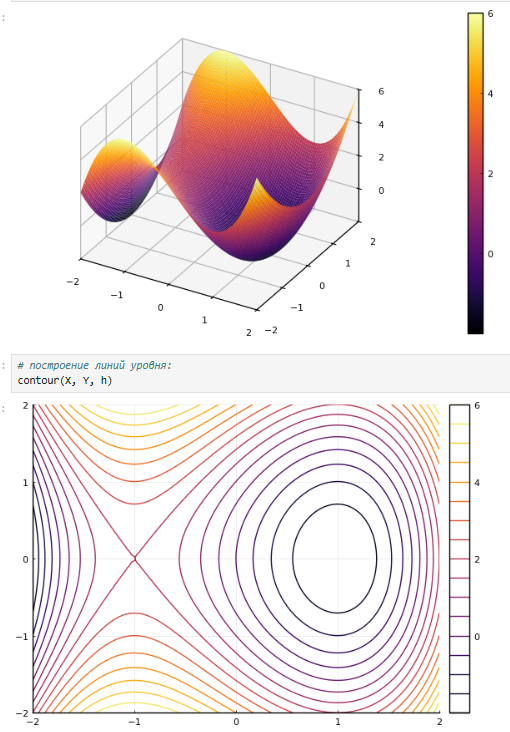{width=100% height=100%}

## Анимация

Технически анимированное изображение представляет собой несколько наложенных
изображений (или построенных в разных точках графиках) в одном файле.

Gif-анимация

В Julia рекомендуется использовать gif-анимацию в pyplot()

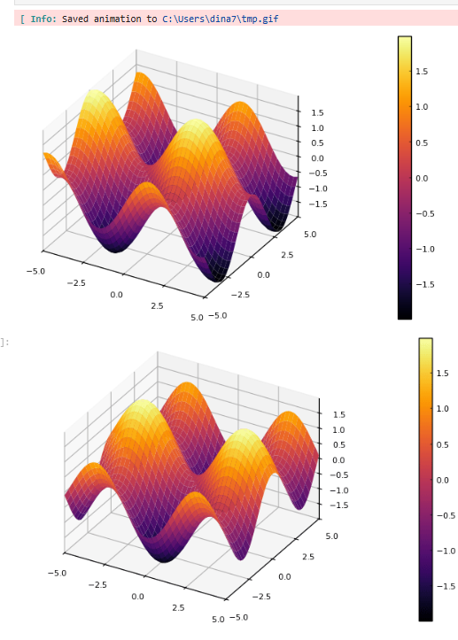{width=100% height=100%}

## Гипоциклоида

Гипоциклоида — плоская кривая, образуемая точкой окружности, катящейся по внутренней стороне другой окружности без скольжения.
Построим гипоциклоиду. Сначала зададим параметры. Затем зададим массивы необходимых значений. Построим оси координат. Построим большую окружность Для частичного построения гипоциклоиды будем менять параметр 𝑡. 
Добавляем малую окружность гипоциклоиды/ Добавим радиус для малой окружности.

В конце сделаем анимацию получившегося изображения 

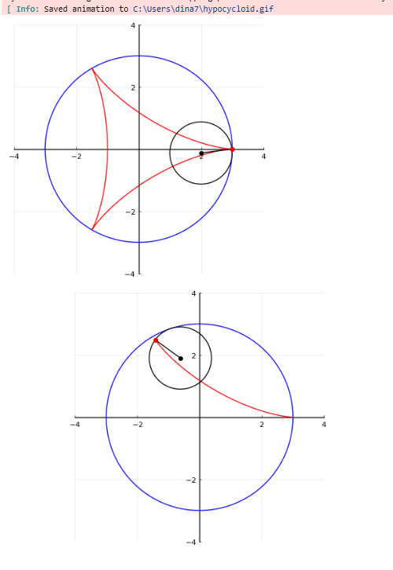{width=100% height=100%}

## Использование пакета Distributions

Строим гистограмму. Задаём нормальное распределение и строим гистограмму 

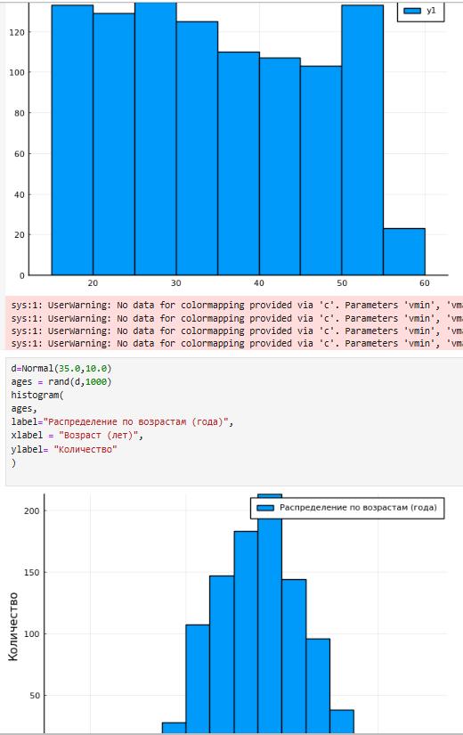{width=100% height=100%}

## Подграфики

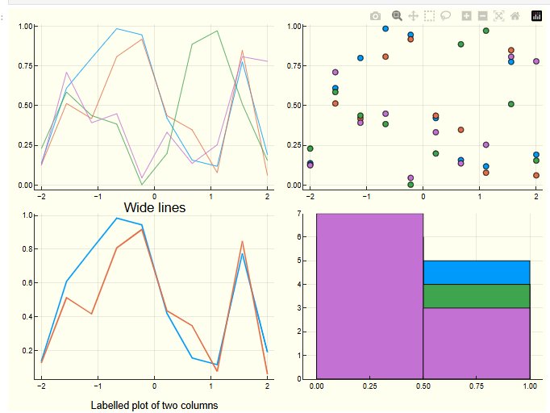{width=100% height=100%}

## Задания для самостоятельного выполнения
1. Постройте все возможные типы графиков (простые, точечные, гистограммы и т.д.)
функции 𝑦 = sin(𝑥), 𝑥 = 0, 2𝜋. Отобразите все графики в одном графическом окне.

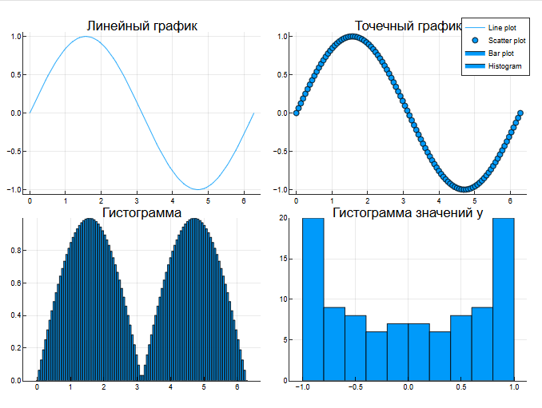{width=100% height=100%}

2. Постройте графики функции 𝑦 = sin(𝑥), 𝑥 = 0, 2𝜋 со всеми возможными (сколько
сможете вспомнить) типами оформления линий графика. Отобразите все графики
в одном графическом окне.

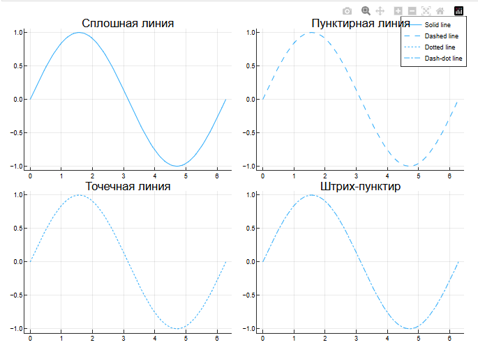{width=100% height=100%}

3. Постройте график функции 𝑦(𝑥) = 𝜋𝑥2
ln(𝑥), назовите оси соответственно. Пусть
цвет рамки будет зелёным, а цвет самого графика — красным. Задайте расстояние
между надписями и осями так, чтобы надписи полностью умещались в графическом
окне. Задайте шрифт надписей. Задайте частоту отметок на осях координат.

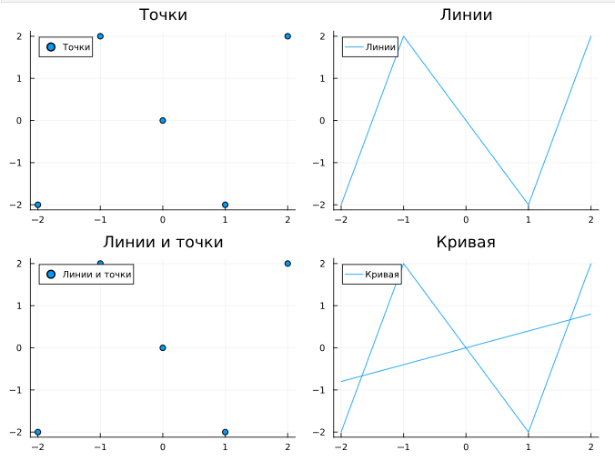{width=100% height=100%}

6. Постройте график некоторых экспериментальных данных (придумайте сами), учитывая ошибку измерения.

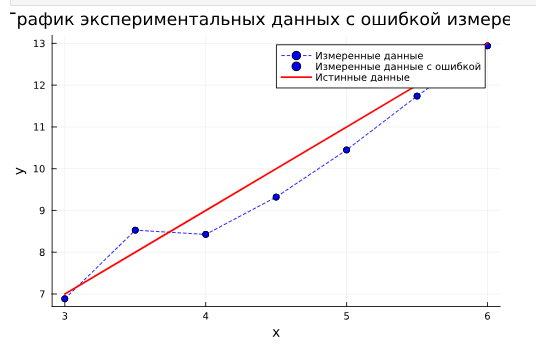{width=100% height=100%}

8. Постройте 3-мерный точечный график случайных данных. Подпишите оси, легенду,
название графика.

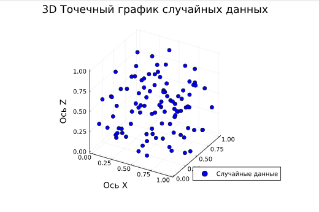{width=100% height=100%}

(В отчете не все отображены задания, т.к. их очень много. А сам файл я не могу загрузить, т.к. он больше 25мб)

# Выводы 

Мы освоиили синтаксис языка Julia для построения графиков.

