---
## Front matter
lang: ru-RU
title: "Компьютерный практикум по статистическому анализу данных. Лаб №6"
subtitle: "Решение моделей в непрерывном и дискретном времени"
author:
  - Шаповалова Диана Дмитриевна
institute:
  - Российский университет дружбы народов, Москва, Россия
date: 19 декабря 2024

## i18n babel
babel-lang: russian
babel-otherlangs: english

## Formatting pdf
toc: false
toc-title: Содержание
slide_level: 2
aspectratio: 169
section-titles: true
theme: metropolis
header-includes:
 - \metroset{progressbar=frametitle,sectionpage=progressbar,numbering=fraction}
---

# Вводная часть

## Цель работы

Основной целью работы является изучение возможностей специализированных пакетов Julia для выполнения и оценки эффективности операций над объектами линейной
алгебры

# Выполнение работы
## Модель экспоненциального роста

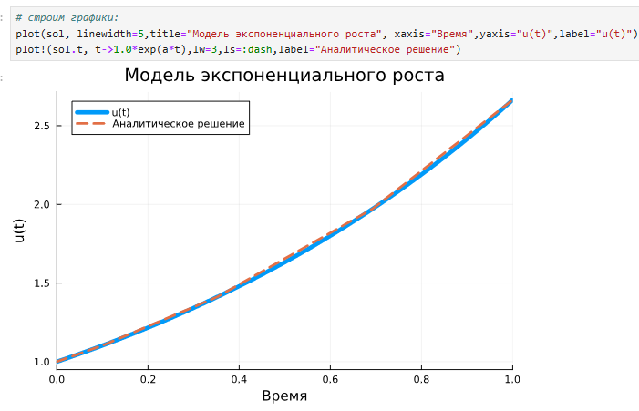{width=100% height=100%}

## Модель экспоненциального роста

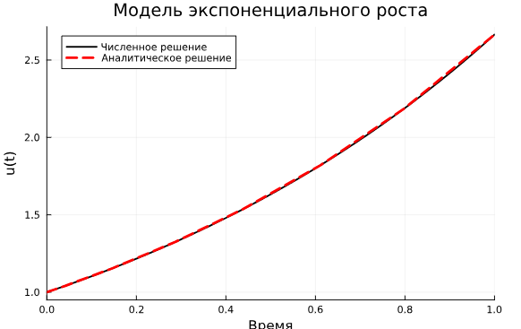{width=100% height=100%}

## Система Лоренца

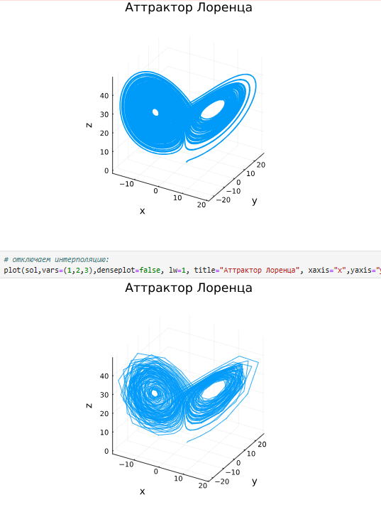{width=100% height=100%}

## Модель Лотки–Вольтерры

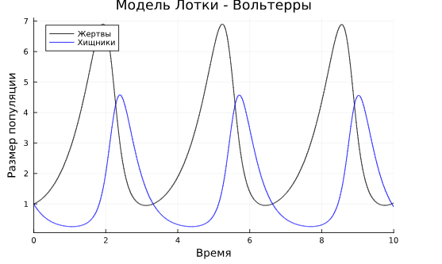{width=100% height=100%}

## Модель Лотки–Вольтерры

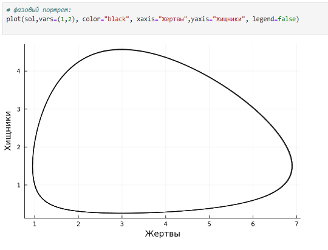{width=100% height=100%}

## Задания для самостоятельного выполнения

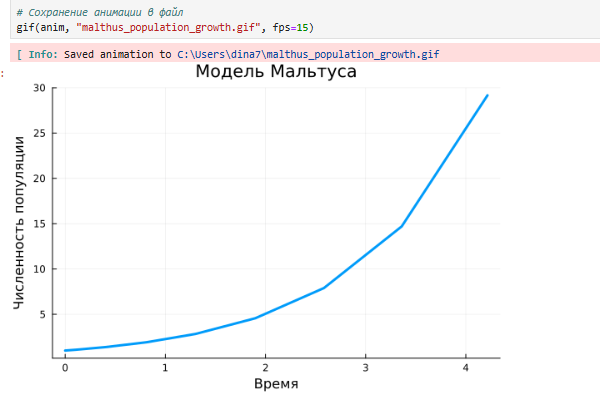{width=100% height=100%}

## Задания для самостоятельного выполнения

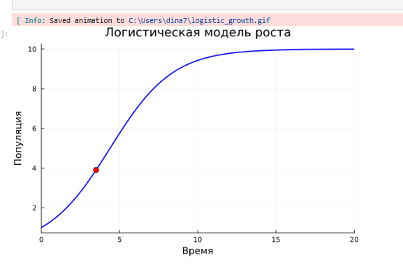{width=100% height=100%}

## Задания для самостоятельного выполнения

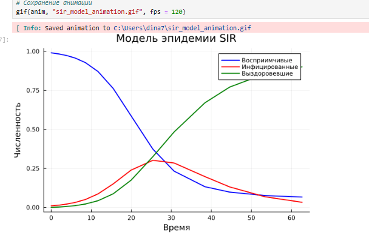{width=100% height=100%}

## Задания для самостоятельного выполнения

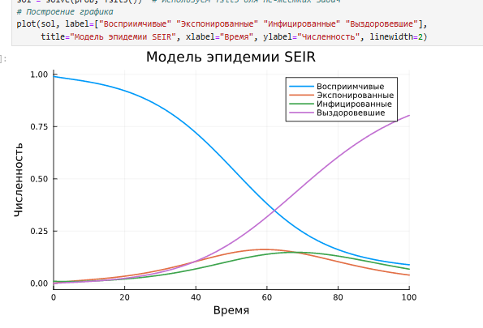{width=100% height=100%}

## Задания для самостоятельного выполнения

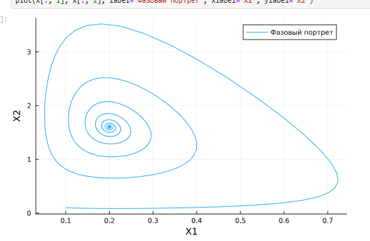{width=100% height=100%}

## Задания для самостоятельного выполнения

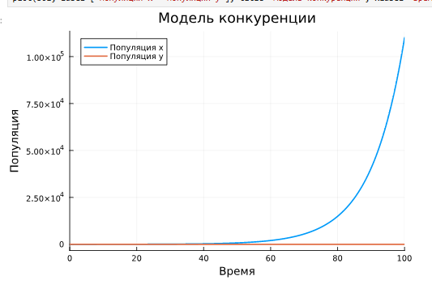{width=100% height=100%}

## Задания для самостоятельного выполнения

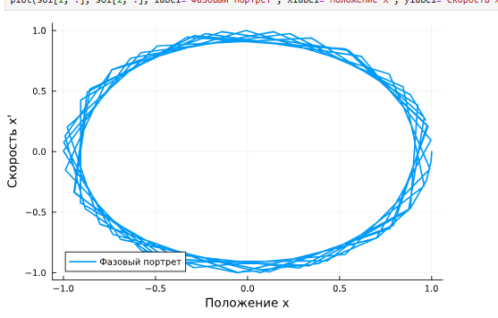{width=100% height=100%}

## Задания для самостоятельного выполнения

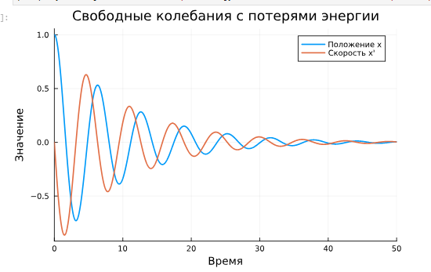{width=100% height=100%}

# Выводы

Я освоила специализированные пакеты для решения задач в непрерывном и дискретном времени.
