---
## Front matter
title: "Отчёт по лабораторной работе №6 по дисциплине
Компьютерный практикум по статистическому анализу данных"
subtitle: "Решение моделей в непрерывном и дискретном времени"
author: "Шаповалова Диана Дмитриевна"

## Generic otions
lang: ru-RU
toc-title: "Содержание"

## Bibliography
bibliography: bib/cite.bib
csl: pandoc/csl/gost-r-7-0-5-2008-numeric.csl

## Pdf output format
toc: true # Table of contents
toc-depth: 2
lof: true # List of figures
lot: true # List of tables
fontsize: 12pt
linestretch: 1.5
papersize: a4
documentclass: scrreprt
## I18n polyglossia
polyglossia-lang:
  name: russian
  options:
	- spelling=modern
	- babelshorthands=true
polyglossia-otherlangs:
  name: english
## I18n babel
babel-lang: russian
babel-otherlangs: english
## Fonts
mainfont: IBM Plex Serif
romanfont: IBM Plex Serif
sansfont: IBM Plex Sans
monofont: IBM Plex Mono
mathfont: STIX Two Math
mainfontoptions: Ligatures=Common,Ligatures=TeX,Scale=0.94
romanfontoptions: Ligatures=Common,Ligatures=TeX,Scale=0.94
sansfontoptions: Ligatures=Common,Ligatures=TeX,Scale=MatchLowercase,Scale=0.94
monofontoptions: Scale=MatchLowercase,Scale=0.94,FakeStretch=0.9
mathfontoptions:
## Biblatex
biblatex: true
biblio-style: "gost-numeric"
biblatexoptions:
  - parentracker=true
  - backend=biber
  - hyperref=auto
  - language=auto
  - autolang=other*
  - citestyle=gost-numeric
## Pandoc-crossref LaTeX customization
figureTitle: "Рис."
tableTitle: "Таблица"
listingTitle: "Листинг"
lofTitle: "Список иллюстраций"
lotTitle: "Список таблиц"
lolTitle: "Листинги"
## Misc options
indent: true
header-includes:
  - \usepackage{indentfirst}
  - \usepackage{float} # keep figures where there are in the text
  - \floatplacement{figure}{H} # keep figures where there are in the text
---

# Цель работы

Основной целью работы является освоение специализированных пакетов для решения
задач в непрерывном и дискретном времени.

# Выполнение работы
## Модель экспоненциального роста

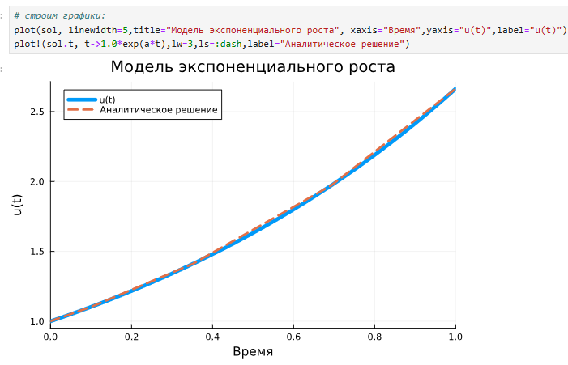{width=100% height=100%}

При построении одного из графиков использовался вызов sol.t, чтобы захватить
массив моментов времени. Массив решений можно получить, воспользовавшись sol.u.
Если требуется задать точность решения, то можно воспользоваться параметрами
abstol (задаёт близость к нулю) и reltol (задаёт относительную точность). По умолчанию эти параметры имеют значение abstol = 1e-6 и reltol = 1e-3.

Для модели экспоненциального роста

{width=100% height=100%}

## Система Лоренца

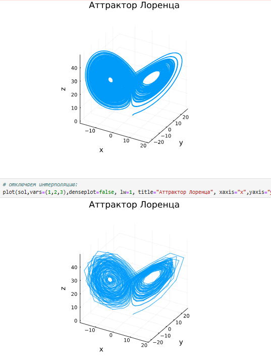{width=100% height=100%}

## Модель Лотки–Вольтерры

Модель Лотки–Вольтерры описывает взаимодействие двух видов типа «хищник – жертва»,
где 𝑥 — количество жертв, 𝑦 — количество хищников,𝑡 — время, 𝛼, 𝛽, 𝛾, 𝛿 — коэффициенты, отражающие взаимодействия между видами (в данном случае 𝛼 — коэффициент
рождаемости жертв, 𝛾 — коэффициент убыли хищников, 𝛽 — коэффициент убыли жертв
в результате взаимодействия с хищниками, 𝛿 — коэффициент роста численности хищников).

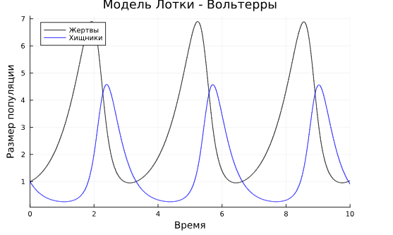{width=100% height=100%}

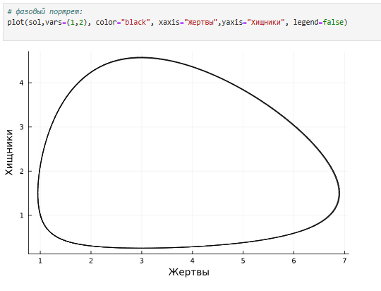{width=100% height=100%}

## Задания для самостоятельного выполнения

1. Реализовать и проанализировать модель роста численности изолированной популяции (модель Мальтуса):
̇𝑥 = 𝑎𝑥, 𝑎 = 𝑏 − 𝑐.
где 𝑥(𝑡) — численность изолированной популяции в момент времени 𝑡, 𝑎 — коэффициент роста популяции, 𝑏 — коэффициент рождаемости, 𝑐 — коэффициент смертности.
Начальные данные и параметры задать самостоятельно и пояснить их выбор. Построить соответствующие графики (в том числе с анимацией).

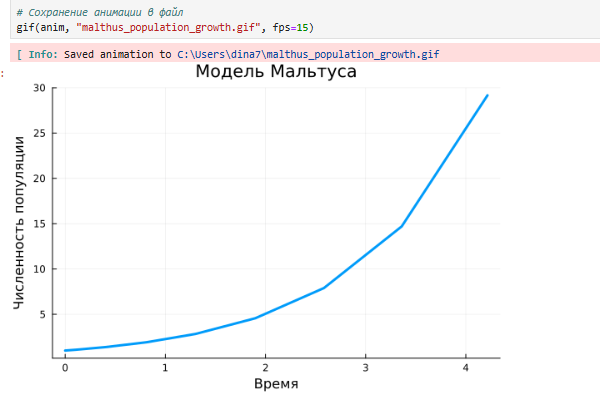{width=100% height=100%}

2. Реализовать и проанализировать логистическую модель роста популяции, заданную
уравнением:
̇𝑥 = 𝑟𝑥 (1 − 𝑥/𝑘) , 𝑟 > 0, 𝑘 > 0,
𝑟 — коэффициент роста популяции, 𝑘 — потенциальная ёмкость экологической системы (предельное значение численности популяции). Начальные данные и параметры
задать самостоятельно и пояснить их выбор. Построить соответствующие графики (в
том числе с анимацией).

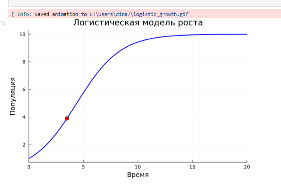{width=100% height=100%}

3. Реализовать и проанализировать модель эпидемии Кермака–Маккендрика (SIRмодель):
̇𝑠 = −𝛽𝑖𝑠,

̇ 𝑖 = 𝛽𝑖𝑠 − 𝜈𝑖,

̇𝑟 = 𝜈𝑖,

где 𝑠(𝑡) — численность восприимчивых к болезни индивидов в момент времени
𝑡, 𝑖(𝑡) — численность инфицированных индивидов в момент времени 𝑡, 𝑟(𝑡) —
численность переболевших индивидов в момент времени 𝑡, 𝛽 — коэффициент интенсивности контактов индивидов с последующим инфицированием, 𝜈 — коэффициент
интенсивности выздоровления инфицированных индивидов. Численность популяции
считается постоянной, т.е. ̇𝑠 + ̇ 𝑖 + ̇𝑟 = 0. Начальные данные и параметры задать
самостоятельно и пояснить их выбор. Построить соответствующие графики (в том
числе с анимацией).

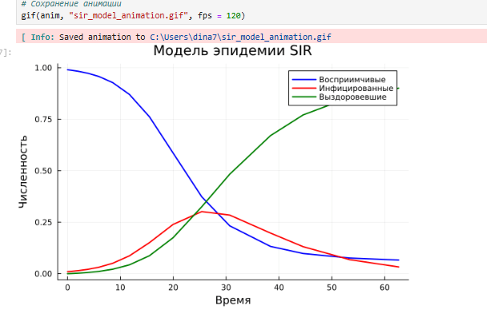{width=100% height=100%}

4. Как расширение модели SIR (Susceptible-Infected-Removed) по результатом эпидемии
испанки была предложена модель SEIR (Susceptible-Exposed-Infected-Removed)
Размер популяции сохраняется:
𝑠(𝑡) + 𝑒(𝑡) + 𝑖(𝑡) + 𝑟(𝑡) = 𝑁.
Исследуйте, сравните с SIR.

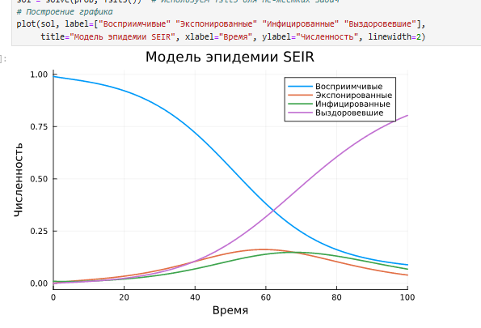{width=100% height=100%}

5. Для дискретной модели Лотки–Вольтерры
с начальными данными 𝑎 = 2, 𝑐 = 1, 𝑑 = 5 найдите точку равновесия. Получите
и сравните аналитическое и численное решения. Численное решение изобразите на
фазовом портрете.

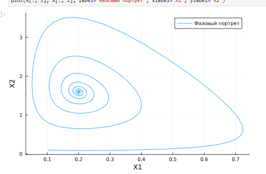{width=100% height=100%}

6. Реализовать на языке Julia модель отбора на основе конкурентных отношений:
̇𝑥 = 𝛼𝑥 − 𝛽𝑥𝑦,

̇𝑦 = 𝛼𝑦 − 𝛽𝑥𝑦.

Начальные данные и параметры задать самостоятельно и пояснить их выбор. Построить соответствующие графики (в том числе с анимацией) и фазовый портрет.

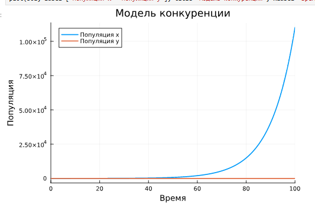{width=100% height=100%}

7. Реализовать на языке Julia модель консервативного гармонического осциллятора
где 𝜔0 — циклическая частота. Начальные параметры подобрать самостоятельно,
выбор пояснить. Построить соответствующие графики (в том числе с анимацией)
и фазовый портрет.

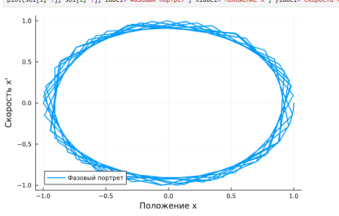{width=100% height=100%}

8. Реализовать на языке Julia модель свободных колебаний гармонического осциллятора
где 𝜔0 — циклическая частота, 𝛾 — параметр, характеризующий потери энергии.
Начальные параметры подобрать самостоятельно, выбор пояснить. Построить соответствующие графики (в том числе с анимацией) и фазовый портрет.

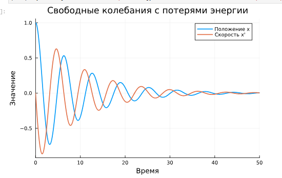{width=100% height=100%}

# Выводы

Я освоила специализированные пакеты для решения задач в непрерывном и дискретном времени.
